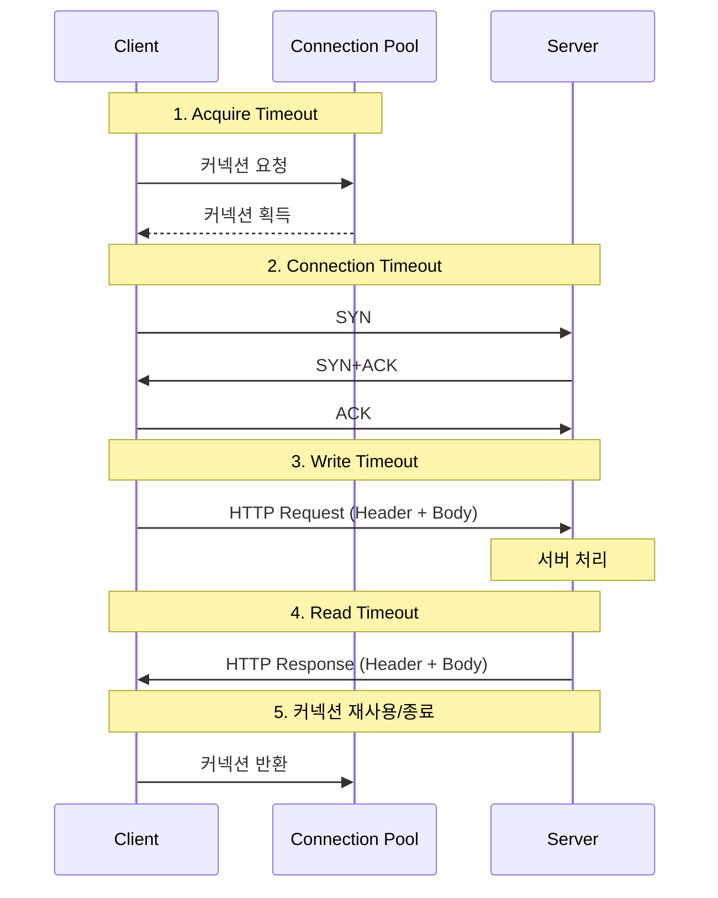
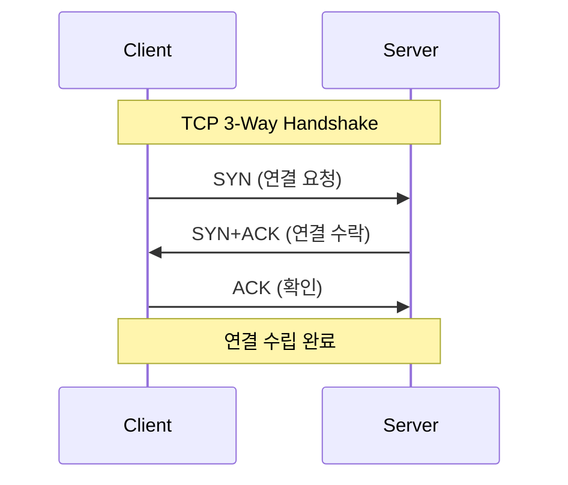
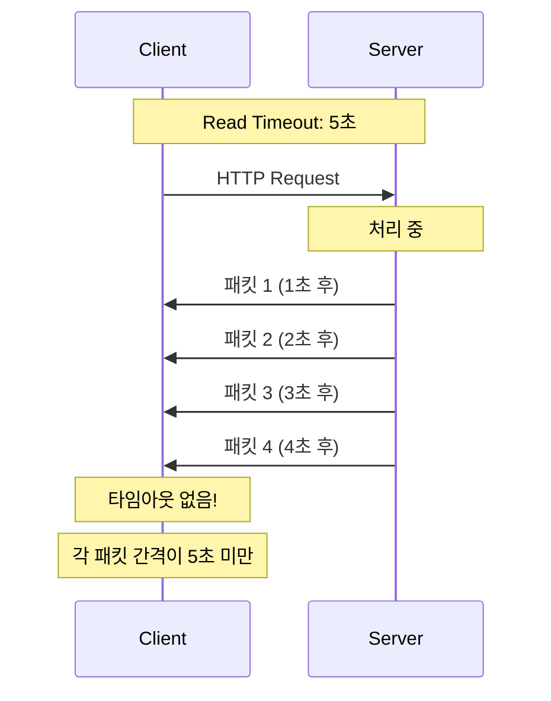
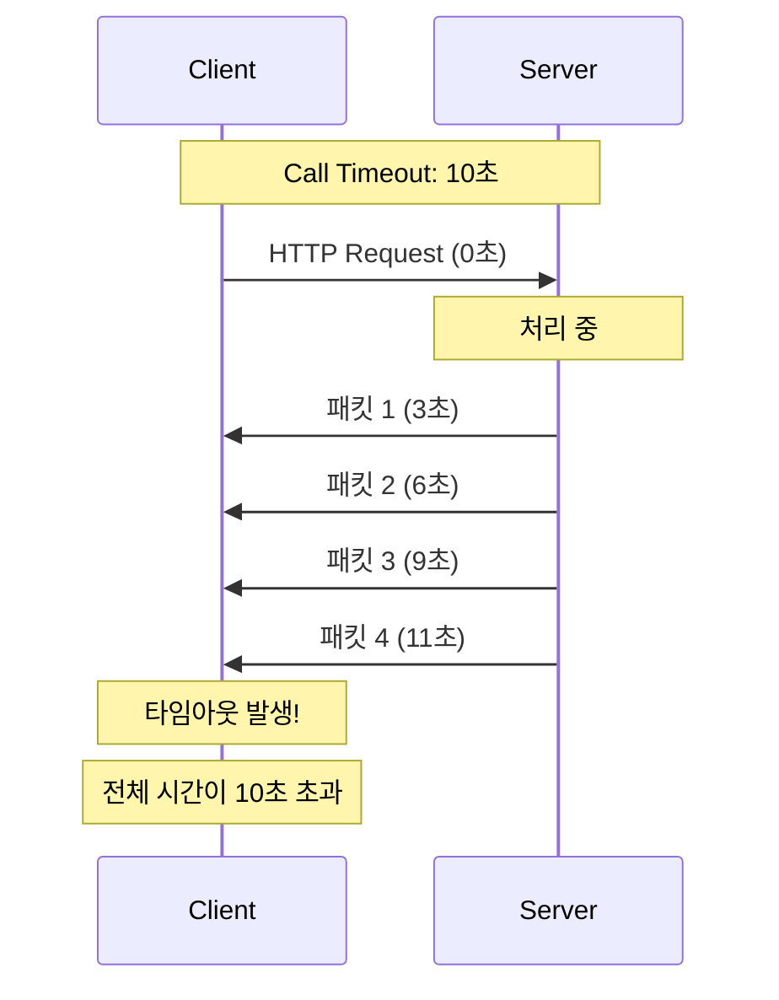
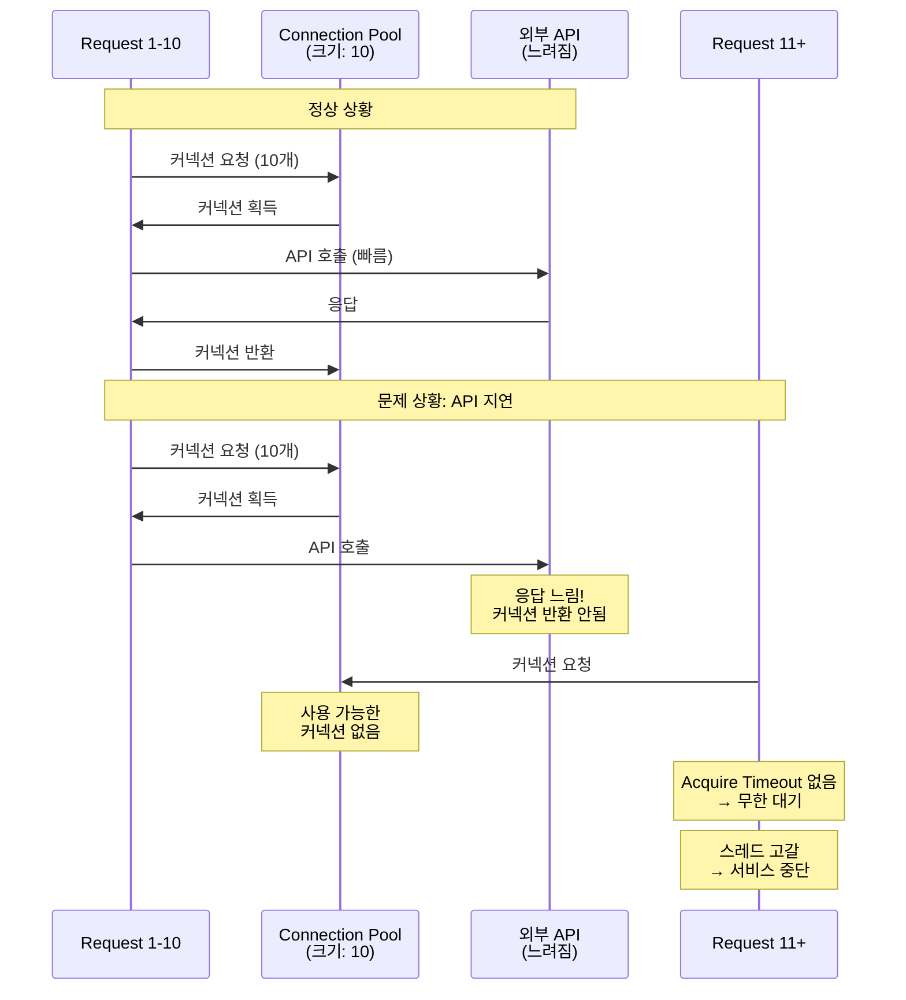
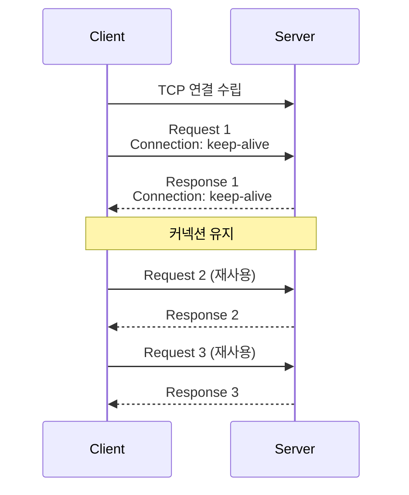
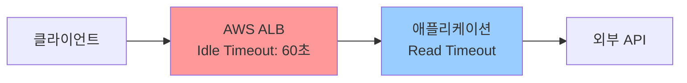
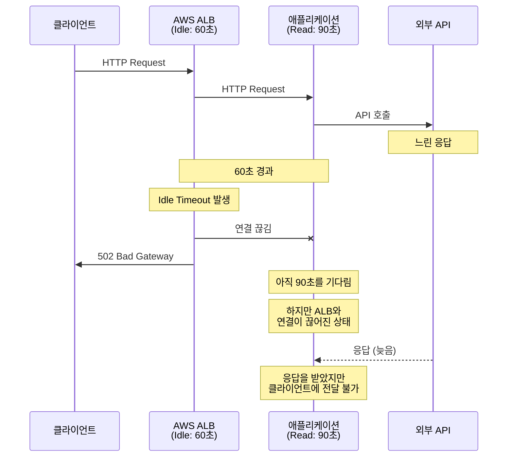
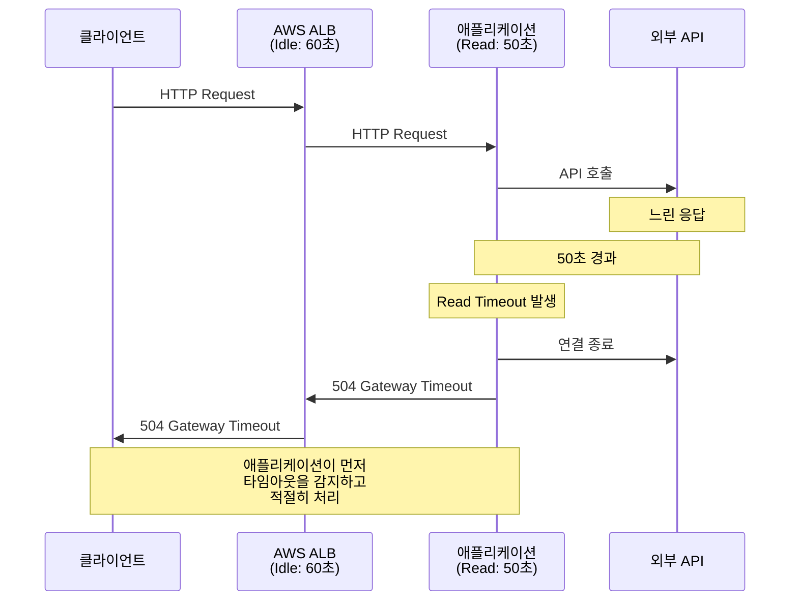

### 2.1 HTTP 통신 과정 개요

HTTP 통신은 다음과 같은 단계를 거쳐 진행된다. 각 단계마다 타임아웃이 발생할 수 있으며, 이를 이해하는 것이 적절한 타임아웃 설정의 기초가 된다.



#### 1) Acquire Timeout (커넥션 획득)

커넥션 풀에서 사용 가능한 커넥션을 얻는 단계이다. 모든 커넥션이 사용 중이면 대기하게 되며, 이 과정에서 **Acquire Timeout**이 적용된다.

#### 2) Connection Timeout (TCP 3-Way Handshake)

클라이언트와 서버 간 TCP 연결을 수립하는 과정이다.



이 단계에서 **Connection Timeout**이 적용된다.

Connection Timeout은 TCP 연결 수립(3-Way Handshake)까지의 제한 시간이다. 클라이언트가 서버와 TCP 연결을 맺을 때까지 기다리는 최대 시간을 의미한다.

**발생 원인**

- 서버가 다운되었거나 응답하지 않는 경우
- 네트워크 장애로 패킷이 전달되지 않는 경우
- 방화벽에서 패킷이 차단되는 경우

**예외**

```java
java.net.SocketException: connect timed out
```

**권장 설정값: 2~3초**

TCP의 재전송 메커니즘을 고려한 값이다. 자세한 근거는 뒤에서...

- **2초**: 1회 패킷 손실까지 커버, 빠른 실패로 스레드 점유 시간 단축
- **3초**: 2회째 SYN 재전송까지 여유 확보, 안정성 우선 시스템에 적합

#### 3) Write Timeout (요청 전송)

HTTP 요청(헤더 + 바디)을 서버로 전송한다. 이 과정에서 **Write Timeout**이 적용될 수 있다.
Write Timeout은 클라이언트가 서버로 요청 데이터를 전송할 때까지 기다리는 최대 시간을 의미한다.

**발생 원인**

- 네트워크 대역폭 부족으로 데이터 전송이 느린 경우
- 대용량 파일 업로드 시 전송 시간 초과
- 서버의 수신 버퍼가 가득 차서 더 이상 받지 못하는 경우

**설정 고려사항**

대부분의 HTTP 요청은 크기가 작아 Write Timeout이 문제가 되지 않는다. 다음과 같은 경우에만 별도로 설정을 고려한다.

1. **대용량 파일 업로드**
   - 파일 크기와 네트워크 속도를 고려한 충분한 시간 설정
   - 예: 100MB 파일, 10Mbps 네트워크 → 최소 80초 + 여유

2. **대량의 JSON/XML 데이터 전송**
   - 배치 데이터 전송, 대량 등록 API 등

**권장 설정값**

일반적인 경우 Read Timeout과 동일하게 설정하거나, 별도 설정이 필요한 경우 전송 데이터 크기를 기준으로 계산한다.

```
Write Timeout = (예상 전송 데이터 크기 / 네트워크 대역폭) × 2
```


#### 4) Read Timeout (응답 수신)

서버로부터 HTTP 응답을 수신한다. 이 단계에서 **Read Timeout**이 적용된다. Read Timeout은 데이터 수신 대기 시간이다. 서버로부터 응답 데이터를 읽을 때까지 기다리는 최대 시간을 의미한다.

HTTP 클라이언트 라이브러리에 따라 Read Timeout의 의미가 다르다. (**패킷 단위 vs 전체 응답 시간**)

**패킷 단위 타임아웃 (Apache HttpClient의 SocketTimeout)**

각 패킷 수신 간격에 적용된다. 전체 응답 시간이 길어도 패킷이 계속 도착하면 타임아웃이 발생하지 않는다.



**전체 응답 시간 타임아웃 (OkHttp의 Call Timeout)**

요청 시작부터 응답 완료까지 전체 시간에 적용된다. 패킷이 계속 도착해도 전체 시간이 초과되면 타임아웃이 발생한다.



**발생 원인**

- 서버의 처리 로직이 오래 걸리는 경우
- 네트워크 지연으로 패킷 전송이 느린 경우
- 서버가 응답을 보내지 않고 대기 상태인 경우

**예외**

```java
java.net.SocketTimeoutException: Read timed out
```

**권장 설정값: 5~30초**

서버의 응답 특성에 따라 달라진다.

- **빠른 응답이 필요한 API**: 5~10초
  - 사용자 대면 서비스, 실시간 조회 API

- **처리 시간이 긴 API**: 20~30초
  - 배치성 작업, 대용량 데이터 조회, 외부 시스템 연동

**설정 시 고려사항**

1. **로드 밸런서의 Idle Timeout과의 관계**
   - 로드 밸런서(ELB, ALB 등)의 Idle Timeout보다 짧게 설정해야 함
   - AWS ALB 기본값: 60초
   - Read Timeout이 Idle Timeout보다 길면 로드 밸런서가 먼저 연결을 끊어버림

2. **서버의 처리 시간 + 네트워크 지연**
   - 서버의 95 percentile 응답 시간에 여유를 둔 값
   - 예: 서버 응답 시간 P95가 3초라면 Read Timeout은 최소 5초 이상

3. **클라이언트 라이브러리의 특성**
   - Apache HttpClient: 패킷 단위 타임아웃
   - OkHttp: Call Timeout과 Read Timeout 분리 가능

#### Acquire Timeout (Connection Pool)

**정의**

커넥션 풀에서 사용 가능한 커넥션을 획득하기까지 대기하는 최대 시간이다.

**발생 원인**

- 커넥션 풀이 모두 사용 중이고 반환되지 않는 경우
- 커넥션 풀 크기가 너무 작은 경우
- 이전 요청들이 타임아웃으로 인해 커넥션을 오래 점유하는 경우

**설정의 중요성**

Acquire Timeout이 없거나 너무 길면 다음과 같은 문제가 발생한다.



시나리오:
1. 외부 API가 느려져서 10개 커넥션이 모두 대기 중
2. 새로운 요청이 들어와도 커넥션을 획득하지 못해 무한 대기
3. 애플리케이션 전체가 멈춤 (모든 요청 스레드가 대기 상태)

**권장 설정값: 1~3초**

Connection Timeout보다 약간 길게 설정한다.

- **짧게 설정 (1초)**: 빠른 실패, 스레드 점유 시간 최소화
- **길게 설정 (3초)**: 일시적인 부하 상황에서 재시도 기회 제공

**커넥션 풀 크기와의 관계**

Acquire Timeout은 커넥션 풀 설정과 함께 고려해야 한다.

```java
// 예시: HikariCP (데이터베이스 커넥션 풀)
hikari.maximum-pool-size=20           // 최대 커넥션 수
hikari.connection-timeout=2000        // Acquire Timeout (ms)

// 예시: Apache HttpClient (HTTP 커넥션 풀)
PoolingHttpClientConnectionManager cm = new PoolingHttpClientConnectionManager();
cm.setMaxTotal(200);                  // 전체 최대 커넥션 수
cm.setDefaultMaxPerRoute(20);         // 호스트별 최대 커넥션 수

RequestConfig config = RequestConfig.custom()
    .setConnectionRequestTimeout(2000) // Acquire Timeout (ms)
    .build();
```


**커넥션 풀 크기 계산**

리틀의 법칙(Little's Law)을 활용하면 더 정확한 계산이 가능하다.

```
L = λ × W
```

- **L**: 시스템 내 평균 요청 수 (필요한 커넥션 수)
- **λ (lambda)**: 초당 도착률 (TPS)
- **W**: 평균 응답 시간 (초 단위)

**예시 1: 일반적인 REST API 호출**

```
조건:
- TPS: 100 req/s
- 평균 응답 시간: 200ms (0.2초)
- P99 응답 시간: 500ms (0.5초)

계산:
- 평균 기준: 100 × 0.2 = 20개
- P99 기준: 100 × 0.5 = 50개
- 버퍼 20% 추가: 50 × 1.2 = 60개

권장 설정: 60개
```

**예시 2: 느린 외부 API 호출**

```
조건:
- TPS: 50 req/s
- 평균 응답 시간: 2초
- P99 응답 시간: 5초

계산:
- 평균 기준: 50 × 2 = 100개
- P99 기준: 50 × 5 = 250개
- 버퍼 20% 추가: 250 × 1.2 = 300개

권장 설정: 300개 (또는 API 호출을 비동기로 전환 검토)
```

**예시 3: 멀티 호스트 환경**

```java
// 3개 호스트에 균등하게 요청 분산
PoolingHttpClientConnectionManager cm = new PoolingHttpClientConnectionManager();
cm.setMaxTotal(150);              // 전체 최대 커넥션: 150개
cm.setDefaultMaxPerRoute(50);     // 호스트별 최대: 50개 (150 / 3)
```

모니터링 지표
1. **Acquire 대기 시간 증가** (P99 > 100ms)
2. **ConnectionRequestTimeout 예외 증가**
3. **풀 사용률 지속적으로 90% 이상**

해결 방법
- 풀 크기 증가
- 응답 시간 개선 (캐싱, 쿼리 최적화)
- 비동기 처리 전환

#### 5) 커넥션 종료/재사용

HTTP/1.1의 Keep-Alive 또는 HTTP/2의 멀티플렉싱을 통해 커넥션을 재사용하거나, 사용이 끝난 후 커넥션을 종료한다.

---

#### HTTP Keep-Alive 설정

**Keep-Alive란?**

HTTP/1.1에서 TCP 커넥션을 재사용하여 성능을 향상시키는 메커니즘이다.



**Keep-Alive Timeout 설정**

서버와 클라이언트 양쪽에서 설정해야 한다.

**서버 설정 (Spring Boot Tomcat)**
```yaml
# application.yml
server:
  tomcat:
    connection-timeout: 60000           # 60초 (요청 대기 시간)
    keep-alive-timeout: 60000           # 60초 (Keep-Alive 유지 시간)
    max-keep-alive-requests: 100        # 최대 100개 요청까지 재사용
```

**클라이언트 설정 (Apache HttpClient)**
```java
@Configuration
public class HttpClientConfig {

    @Bean
    public CloseableHttpClient httpClient() {
        PoolingHttpClientConnectionManager cm = new PoolingHttpClientConnectionManager();
        cm.setMaxTotal(200);
        cm.setDefaultMaxPerRoute(20);

        // Keep-Alive 전략
        ConnectionKeepAliveStrategy keepAliveStrategy = (response, context) -> {
            // 서버가 Keep-Alive 헤더를 보내면 그 값 사용
            HeaderElementIterator it = new BasicHeaderElementIterator(
                response.headerIterator(HTTP.CONN_KEEP_ALIVE));

            while (it.hasNext()) {
                HeaderElement he = it.nextElement();
                String param = he.getName();
                String value = he.getValue();
                if (value != null && param.equalsIgnoreCase("timeout")) {
                    return Long.parseLong(value) * 1000;
                }
            }

            // 서버가 Keep-Alive 헤더를 안 보내면 기본값 30초
            return 30 * 1000;
        };

        return HttpClients.custom()
            .setConnectionManager(cm)
            .setKeepAliveStrategy(keepAliveStrategy)
            .build();
    }
}
```

**Keep-Alive 설정 권장값**

| 환경             | Keep-Alive Timeout | 이유                      |
| -------------- | ------------------ | ----------------------- |
| **내부 마이크로서비스** | 60~120초            | 빈번한 통신, 긴 유지 시간으로 성능 향상 |
| **외부 API**     | 30~60초             | 적당한 유지 시간, 방화벽/프록시 고려   |
| **모바일 클라이언트**  | 20~30초             | 짧은 유지 시간, NAT 타임아웃 고려   |

---

#### Keep-Alive와 프록시 환경 문제

Nginx의 기본 설정은 `proxy_http_version 1.0`이고, HTTP/1.0은 Keep-Alive를 지원하지 않는다.

**해결 방법**

```nginx
# nginx.conf
http {
    upstream backend {
        server backend1:8080;
        server backend2:8080;

        # Keep-Alive 설정
        keepalive 32;           # Upstream 서버당 유지할 idle 커넥션 수
        keepalive_timeout 60s;  # Keep-Alive 타임아웃
        keepalive_requests 100; # 커넥션당 최대 요청 수
    }

    server {
        listen 80;

        location / {
            proxy_pass http://backend;

            # ✅ HTTP/1.1 사용 (Keep-Alive 지원)
            proxy_http_version 1.1;

            # ✅ Connection 헤더 제거 (Nginx가 관리)
            proxy_set_header Connection "";

            # 기타 헤더
            proxy_set_header Host $host;
            proxy_set_header X-Real-IP $remote_addr;
            proxy_set_header X-Forwarded-For $proxy_add_x_forwarded_for;
        }
    }
}
```

예시
- 프록시 (ALB): 60초
- 서버 (Tomcat): 50초
- 클라이언트 (WebClient): 40초

#### 로드 밸런서와의 관계



**중요한 원칙**

```
애플리케이션 Read Timeout < 로드 밸런서 Idle Timeout
```

**잘못된 설정 예시**

```
AWS ALB Idle Timeout: 60초
애플리케이션 Read Timeout: 90초
```



문제점
- 애플리케이션이 90초를 기다리지만 ALB가 60초에 먼저 끊어버림
- 502 Bad Gateway 에러 발생
- 리소스 낭비 (애플리케이션은 계속 대기)

**올바른 설정 예시**

```
AWS ALB Idle Timeout: 60초
애플리케이션 Read Timeout: 50초
```



장점:
- 애플리케이션이 먼저 타임아웃을 감지하고 적절히 처리
- 명확한 에러 응답 (504 Gateway Timeout)
- 리소스를 빠르게 회수

---

#### 데이터베이스 관련 타임아웃

HTTP 클라이언트뿐만 아니라 데이터베이스 연결에도 타임아웃 설정이 필요하다.

**Statement Timeout**

단일 SQL 쿼리의 최대 실행 시간을 제한한다.

```java
// JDBC
Statement stmt = connection.createStatement();
stmt.setQueryTimeout(10); // 10초

// Spring Boot (application.yml)
spring:
  datasource:
    hikari:
      data-source-properties:
        oracle.jdbc.ReadTimeout: 10000
```

**권장 설정값**
- OLTP 쿼리: 5~10초
- 분석/배치 쿼리: 30~60초

**Transaction Timeout**

트랜잭션 전체의 실행 시간을 제한한다.

```java
@Transactional(timeout = 30) // 30초
public void processOrder(Order order) {
    // 여러 쿼리 실행
}
```

**권장 설정값**

```
Transaction Timeout > (Statement Timeout × 예상 쿼리 수) + 오버헤드
```

예시: Statement Timeout 10초, 평균 3개 쿼리 실행 → Transaction Timeout 40초

**SocketTimeout (JDBC Driver)**

DBMS와의 네트워크 통신에서 패킷 수신 대기 시간이다.

```java
// MySQL
spring:
  datasource:
    url: jdbc:mysql://localhost:3306/db?socketTimeout=30000

// PostgreSQL
spring:
  datasource:
    url: jdbc:postgresql://localhost:5432/db?socketTimeout=30
```

**중요한 원칙**

```
SocketTimeout > Statement Timeout
```

SocketTimeout이 Statement Timeout보다 작으면 SocketTimeout이 먼저 발생하여 Statement Timeout이 무의미해진다.

권장 설정:
- Statement Timeout: 10초
- SocketTimeout: 15초 (Statement Timeout + 여유)
