Connection Timeout은 클라이언트가 서버와 TCP 연결을 수립하는 데 걸리는 최대 시간을 의미한다. 이 시간은 TCP 3-Way Handshake 과정이 완료되기까지의 시간으로, 네트워크 상태와 서버 응답성에 직접적인 영향을 받는다.

개발 블로그를 보면 Connection Timeout을 무심코 3초 또는 5초로 설정하는 경우가 많은데, 이는 TCP 재전송 메커니즘에 대한 이해 없이 임의로 정한 값일 가능성이 높다. Linux 커널의 TCP 재전송 메커니즘을 깊이 이해하고, 그에 기반한 최적의 Connection Timeout 값을 찾아보자.

### 3.1 TCP 연결 과정의 기술적 이해

#### TCP 3-Way Handshake

TCP 연결은 3-Way Handshake를 통해 수립된다

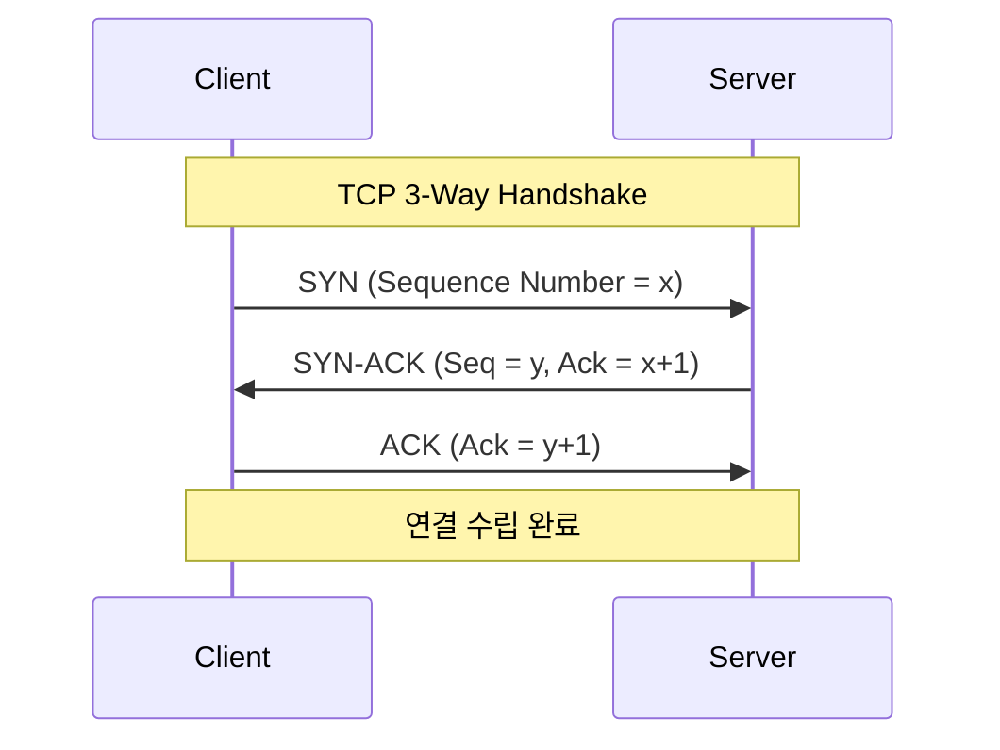
```mermaid
sequenceDiagram
    participant Client
    participant Server

    Note over Client,Server: TCP 3-Way Handshake
    Client->>Server: SYN (Sequence Number = x)
    Server->>Client: SYN-ACK (Seq = y, Ack = x+1)
    Client->>Server: ACK (Ack = y+1)
    Note over Client,Server: 연결 수립 완료
```

**각 단계의 의미**

1. **SYN (Synchronize)**: 클라이언트가 서버에 연결 요청을 보낸다. 초기 시퀀스 번호(ISN)를 포함한다.
2. **SYN-ACK**: 서버가 연결 요청을 수락하고, 자신의 초기 시퀀스 번호를 보낸다.
3. **ACK (Acknowledgment)**: 클라이언트가 서버의 응답을 확인하고, 연결이 수립된다.

#### 정상적인 연결 시간

이상적인 네트워크 환경에서 3-Way Handshake는 다음과 같이 진행된다

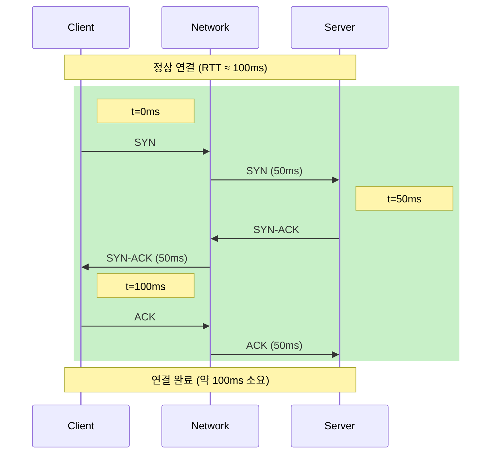
```mermaid
sequenceDiagram
    participant Client
    participant Network
    participant Server

    Note over Client,Server: 정상 연결 (RTT ≈ 100ms)
    rect rgb(200, 240, 200)
        Note right of Client: t=0ms
        Client->>Network: SYN
        Network->>Server: SYN (50ms)
        Note right of Server: t=50ms
        Server->>Network: SYN-ACK
        Network->>Client: SYN-ACK (50ms)
        Note right of Client: t=100ms
        Client->>Network: ACK
        Network->>Server: ACK (50ms)
    end
    Note over Client,Server: 연결 완료 (약 100ms 소요)
```

**일반적인 RTT (Round Trip Time) 값**
- 같은 AWS 리전 내: 1-5ms
- 서로 다른 리전 (예: 서울-도쿄): 30-50ms
- 대륙 간 통신 (예: 서울-미국 서부): 150-200ms
- 일반적인 인터넷 환경: 30-300ms

정상적인 경우, Connection Timeout은 **1초 이내**에 완료된다.

### 3.2 Linux initRTO와 재전송 메커니즘

#### initRTO (Initial Retransmission Timeout)

TCP 연결 초기에는 RTT를 알 수 없기 때문에, Linux 커널은 **initRTO = 1초**라는 고정 값을 사용한다.

**왜 1초인가?**
- RFC 6298에서 권장하는 초기값
- 3-Way Handshake가 완료되기 전까지는 RTT 측정 불가
- Handshake 완료 후에는 실제 RTT로 RTO 갱신 (최소값 200ms)

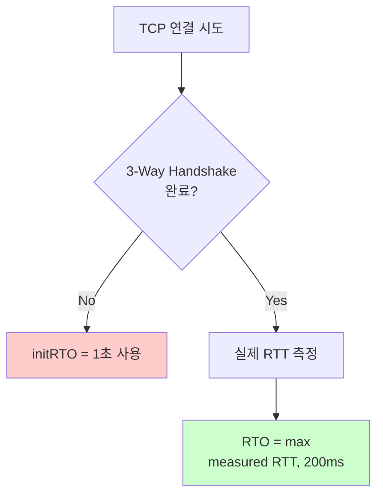
```mermaid
graph TD
    A[TCP 연결 시도] --> B{3-Way Handshake<br/>완료?}
    B -->|No| C[initRTO = 1초 사용]
    B -->|Yes| D[실제 RTT 측정]
    D --> E[RTO = max<br/>measured RTT, 200ms]

    style C fill:#ffcccc
    style E fill:#ccffcc
```

#### 지수 백오프 (Exponential Backoff)

패킷이 손실되면 Linux는 지수 백오프 알고리즘으로 재전송한다

```
재전송 시도   대기 시간   누적 시간
   1회         1초        1초
   2회         2초        3초
   3회         4초        7초
   4회         8초        15초
   5회        16초        31초
   6회        32초        63초
```

**기본 설정:**
- `net.ipv4.tcp_syn_retries = 6` (총 6회 재시도)
- 총 대기 시간: 약 127초 (2분 이상)

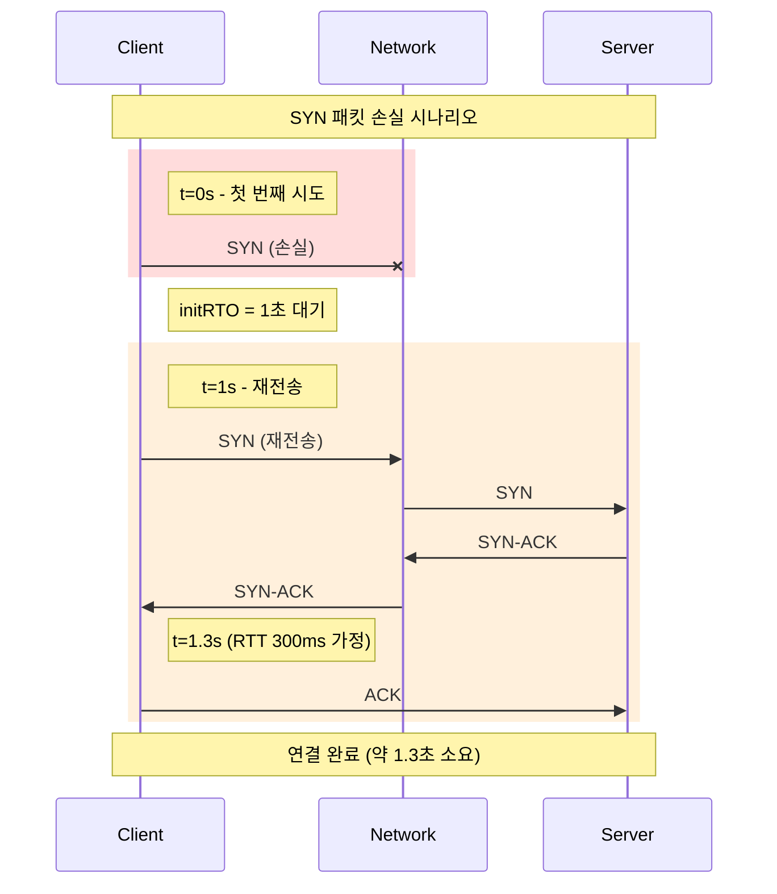
```mermaid
sequenceDiagram
    participant Client
    participant Network
    participant Server

    Note over Client,Server: SYN 패킷 손실 시나리오

    rect rgb(255, 220, 220)
        Note right of Client: t=0s - 첫 번째 시도
        Client-xNetwork: SYN (손실)
    end

    Note right of Client: initRTO = 1초 대기

    rect rgb(255, 240, 220)
        Note right of Client: t=1s - 재전송
        Client->>Network: SYN (재전송)
        Network->>Server: SYN
        Server->>Network: SYN-ACK
        Network->>Client: SYN-ACK
        Note right of Client: t=1.3s (RTT 300ms 가정)
        Client->>Server: ACK
    end

    Note over Client,Server: 연결 완료 (약 1.3초 소요)
```

### 3.3 패킷 손실 시나리오 분석

#### 시나리오 1: 정상 연결 (패킷 손실 없음)

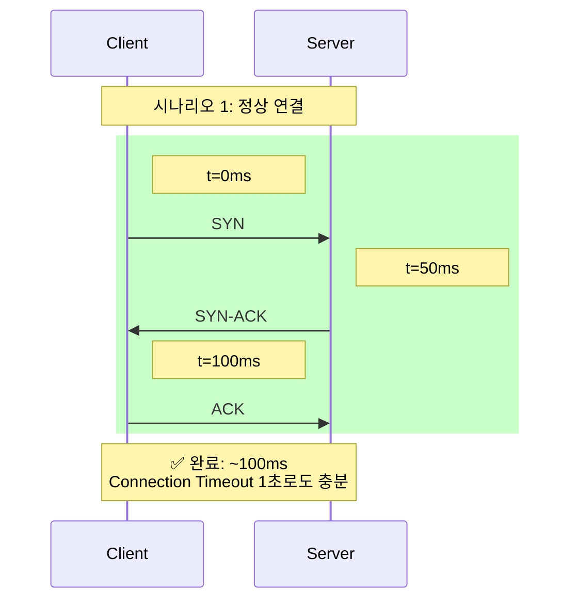
```mermaid
sequenceDiagram
    participant Client
    participant Server

    Note over Client,Server: 시나리오 1: 정상 연결
    rect rgb(200, 255, 200)
        Note right of Client: t=0ms
        Client->>Server: SYN
        Note right of Server: t=50ms
        Server->>Client: SYN-ACK
        Note right of Client: t=100ms
        Client->>Server: ACK
    end
    Note over Client,Server: ✅ 완료: ~100ms<br/>Connection Timeout 1초로도 충분
```

**소요 시간:** RTT 1회 = 약 100ms (일반적인 경우)

#### 시나리오 2: 1회 패킷 손실

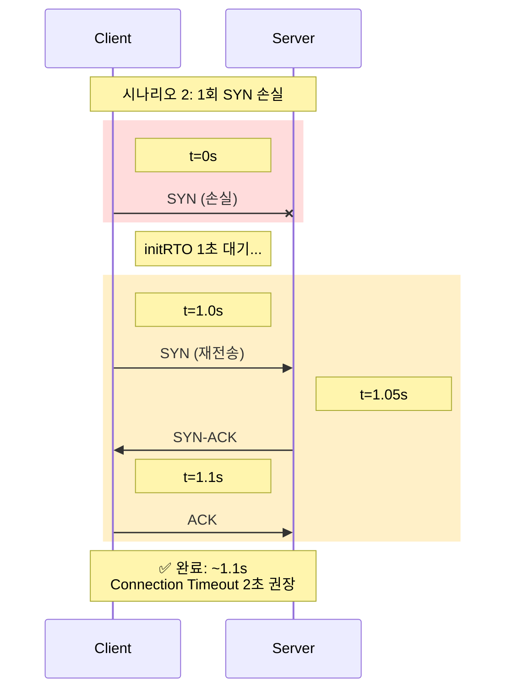
```mermaid
sequenceDiagram
    participant Client
    participant Server

    Note over Client,Server: 시나리오 2: 1회 SYN 손실
    rect rgb(255, 220, 220)
        Note right of Client: t=0s
        Client-xServer: SYN (손실)
    end

    Note right of Client: initRTO 1초 대기...

    rect rgb(255, 240, 200)
        Note right of Client: t=1.0s
        Client->>Server: SYN (재전송)
        Note right of Server: t=1.05s
        Server->>Client: SYN-ACK
        Note right of Client: t=1.1s
        Client->>Server: ACK
    end
    Note over Client,Server: ✅ 완료: ~1.1s<br/>Connection Timeout 2초 권장
```

**소요 시간:** 1초 (initRTO) + RTT = 약 1.1~1.3초

**발생 확률:**
- 일반적인 인터넷: 1-3%
- 품질 좋은 IDC 간 통신: 0.1% 미만

#### 시나리오 3: 2회 연속 패킷 손실

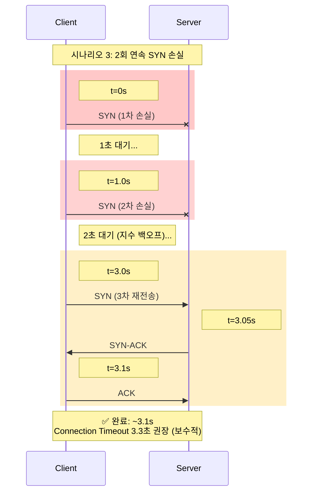
```mermaid
sequenceDiagram
    participant Client
    participant Server

    Note over Client,Server: 시나리오 3: 2회 연속 SYN 손실
    rect rgb(255, 200, 200)
        Note right of Client: t=0s
        Client-xServer: SYN (1차 손실)
    end

    Note right of Client: 1초 대기...

    rect rgb(255, 210, 210)
        Note right of Client: t=1.0s
        Client-xServer: SYN (2차 손실)
    end

    Note right of Client: 2초 대기 (지수 백오프)...

    rect rgb(255, 240, 200)
        Note right of Client: t=3.0s
        Client->>Server: SYN (3차 재전송)
        Note right of Server: t=3.05s
        Server->>Client: SYN-ACK
        Note right of Client: t=3.1s
        Client->>Server: ACK
    end
    Note over Client,Server: ✅ 완료: ~3.1s<br/>Connection Timeout 3.3초 권장 (보수적)
```

**소요 시간:** 1초 + 2초 (지수 백오프) + RTT = 약 3.1~3.3초

**발생 확률:**
- 일반적인 인터넷: 0.01-0.1%
- 품질 좋은 IDC 간 통신: 거의 발생하지 않음 (< 0.001%)

### 3.4 최적 Connection Timeout 값 도출

#### 옵션 1: 1.3초

**근거:**
- 정상 연결: 100ms
- 1회 패킷 손실 시: 1초 (initRTO) + 300ms (최대 RTT) = 1.3초

**장점:**
- 빠른 실패로 스레드 점유 시간 최소화
- 서버 리소스 효율적 활용

**단점:**
- RTT가 300ms를 초과하는 경우 재시도 실패 가능
- 네트워크 품질이 좋지 않은 환경에서 false negative

**적용 환경:**
- 같은 리전 내 AWS/IDC 간 통신
- 매우 안정적인 네트워크 환경
- 빠른 실패가 중요한 시스템

#### 옵션 2: 2초

**근거:**
- 1회 패킷 손실 시: 1.3초 (계산값)
- 여유 버퍼: 약 50% (700ms)
- 대부분의 실무 환경에서 안전한 값

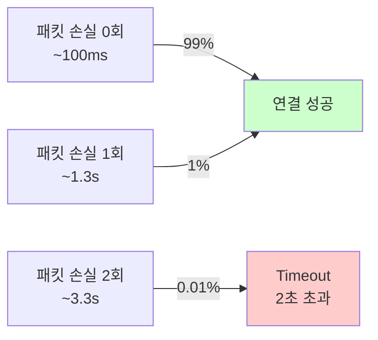
```mermaid
graph LR
    A[패킷 손실 0회<br/>~100ms] -->|99%| B[연결 성공]
    C[패킷 손실 1회<br/>~1.3s] -->|1%| B
    D[패킷 손실 2회<br/>~3.3s] -->|0.01%| E[Timeout<br/>2초 초과]

    style B fill:#ccffcc
    style E fill:#ffcccc
```

**장점:**
- 1회 패킷 손실까지 안정적으로 커버
- 충분한 버퍼로 RTT 변동성 흡수
- 빠른 실패로 cascading failure 방지

**단점:**
- 2회 연속 손실 시 연결 실패 (하지만 발생 확률 극히 낮음)

**적용 환경:**
- 대부분의 실무 프로덕션 환경 (강력 권장)
- 마이크로서비스 간 통신
- 외부 API 호출

#### 옵션 3: 3초

**문제점:**

많은 블로그와 문서에서 3초를 권장하지만, 이는 **비효율적**이다:

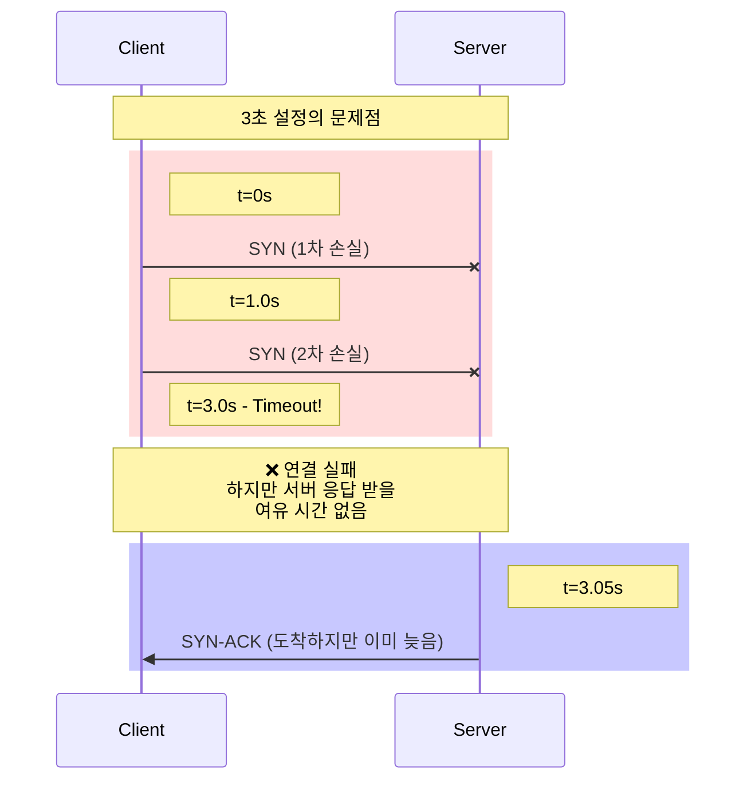
```mermaid
sequenceDiagram
    participant Client
    participant Server

    Note over Client,Server: 3초 설정의 문제점

    rect rgb(255, 220, 220)
        Note right of Client: t=0s
        Client-xServer: SYN (1차 손실)
        Note right of Client: t=1.0s
        Client-xServer: SYN (2차 손실)
        Note right of Client: t=3.0s - Timeout!
    end

    Note over Client,Server: ❌ 연결 실패<br/>하지만 서버 응답 받을<br/>여유 시간 없음

    rect rgb(200, 200, 255)
        Note right of Server: t=3.05s
        Server->>Client: SYN-ACK (도착하지만 이미 늦음)
    end
```

- 2회 연속 손실 후 3차 재전송 시각: 3.0초
- 서버로부터 SYN-ACK 수신: 3.0초 + RTT (예: 300ms) = 3.3초
- **3초 Timeout 설정 시**: 3차 재전송이 성공해도 응답을 받기 전에 타임아웃

**더 나쁜 점:**
- 2초 대비 스레드 점유 시간 50% 증가
- 하지만 2회 연속 손실 복구는 불가능 (3.3초 필요)
- 불필요한 대기 시간만 늘어남

#### 옵션 4: 3.3초

**근거:**
- 2회 연속 패킷 손실 시: 3.0초 (재전송 대기) + 300ms (RTT) = 3.3초
- 2회 연속 손실까지 안정적으로 복구

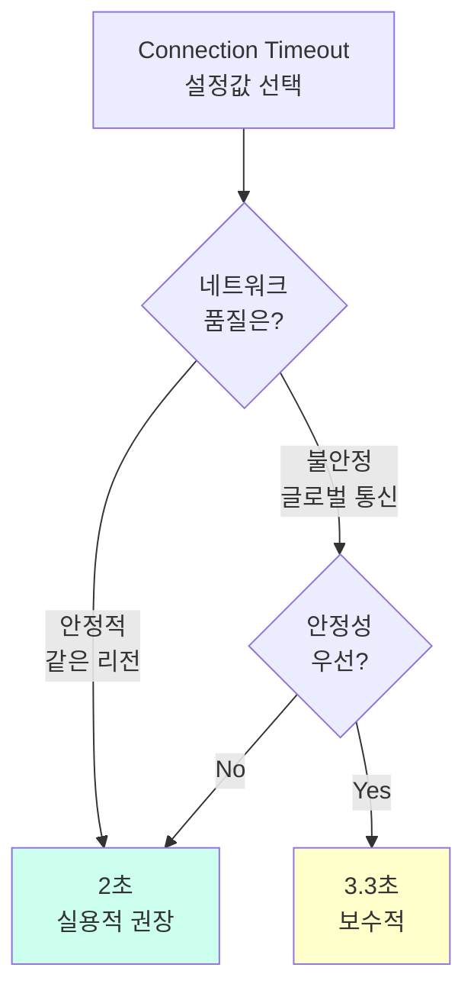
```mermaid
graph TD
    A[Connection Timeout<br/>설정값 선택] --> B{네트워크<br/>품질은?}
    B -->|안정적<br/>같은 리전| C[2초<br/>실용적 권장]
    B -->|불안정<br/>글로벌 통신| D{안정성<br/>우선?}
    D -->|Yes| E[3.3초<br/>보수적]
    D -->|No| C

    style C fill:#ccffee
    style E fill:#ffffcc
```

**장점:**
- 2회 연속 손실까지 복구 가능 (발생 확률 0.01%)
- 최대한의 안정성 확보

**단점:**
- 스레드 점유 시간 증가 (2초 대비 65% 증가)
- 대부분의 경우 불필요한 대기

**적용 환경:**
- 금융권 등 안정성이 최우선인 시스템
- 글로벌 통신 (대륙 간)
- 네트워크 품질이 매우 불안정한 환경

### 3.5 요약

| 설정값 | 커버 범위 | 스레드 점유 시간 | 권장도 |
|-------|----------|----------------|--------|
| 1.3초 | 1회 손실 (여유 없음) | 최소 | ⚠️ 특수 환경 |
| **2.0초** | **1회 손실 + 50% 버퍼** | **보통** | **⭐️ 강력 권장** |
| 3.0초 | 2회 손실 커버 실패 | 높음 | ❌ 비권장 |
| 3.3초 | 2회 손실 완전 커버 | 매우 높음 | △ 안정성 우선 시 |

### 3.6 재시도 전략

#### 3.6.1 재시도가 필요한 이유

네트워크 통신은 본질적으로 불안정하다. 일시적인 패킷 손실, 네트워크 혼잡, 서버 과부하 등으로 인해 연결이 실패할 수 있지만, 재시도를 통해 극복 가능한 경우가 많다.

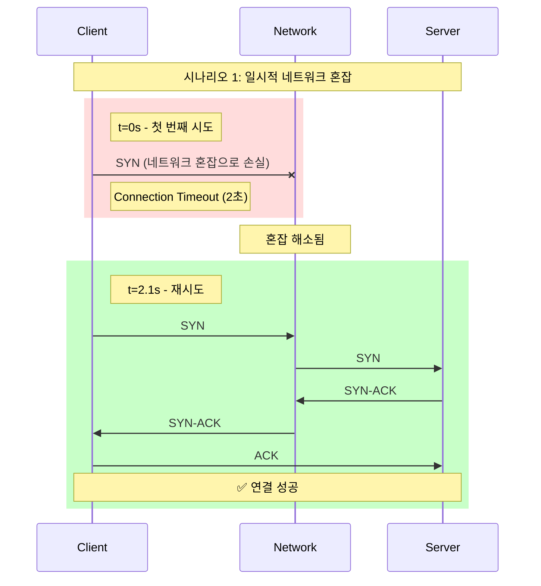
```mermaid
sequenceDiagram
    participant Client
    participant Network
    participant Server

    Note over Client,Server: 시나리오 1: 일시적 네트워크 혼잡

    rect rgb(255, 220, 220)
        Note right of Client: t=0s - 첫 번째 시도
        Client-xNetwork: SYN (네트워크 혼잡으로 손실)
        Note right of Client: Connection Timeout (2초)
    end

    Note over Network: 혼잡 해소됨

    rect rgb(200, 255, 200)
        Note right of Client: t=2.1s - 재시도
        Client->>Network: SYN
        Network->>Server: SYN
        Server->>Network: SYN-ACK
        Network->>Client: SYN-ACK
        Client->>Server: ACK
        Note over Client,Server: ✅ 연결 성공
    end
```

**재시도로 극복 가능한 장애:**
- 일시적 네트워크 혼잡 (패킷 손실)
- 서버 일시적 과부하 (SYN backlog queue 포화)
- 네트워크 경로 재설정 (라우팅 변경)

#### 3.6.2 재시도 가능 여부 판단 기준

모든 실패 상황에서 재시도가 유효한 것은 아니다. 재시도 여부를 신중하게 결정해야 한다.

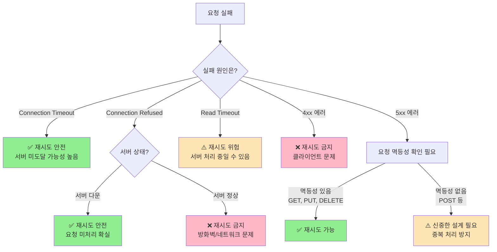
```mermaid
graph TD
    Start[요청 실패] --> Q1{실패 원인은?}

    Q1 -->|Connection Timeout| Safe1[✅ 재시도 안전<br/>서버 미도달 가능성 높음]
    Q1 -->|Connection Refused| Analyze1{서버 상태?}
    Q1 -->|Read Timeout| Dangerous[⚠️ 재시도 위험<br/>서버 처리 중일 수 있음]
    Q1 -->|4xx 에러| NoRetry[❌ 재시도 금지<br/>클라이언트 문제]
    Q1 -->|5xx 에러| Check[요청 멱등성 확인 필요]

    Analyze1 -->|서버 다운| Safe2[✅ 재시도 안전<br/>요청 미처리 확실]
    Analyze1 -->|서버 정상| NoRetry2[❌ 재시도 금지<br/>방화벽/네트워크 문제]

    Check -->|멱등성 있음<br/>GET, PUT, DELETE| Safe3[✅ 재시도 가능]
    Check -->|멱등성 없음<br/>POST 등| Dangerous2[⚠️ 신중한 설계 필요<br/>중복 처리 방지]

    style Safe1 fill:#90EE90
    style Safe2 fill:#90EE90
    style Safe3 fill:#90EE90
    style Dangerous fill:#FFE4B5
    style Dangerous2 fill:#FFE4B5
    style NoRetry fill:#FFB6C6
    style NoRetry2 fill:#FFB6C6
```

**재시도 가능한 3가지 조건**

재시도는 다음 조건 중 하나 이상을 만족할 때만 안전하다

1. **단순 조회 기능 (GET)**: 여러 번 호출해도 서버 상태가 변하지 않음
2. **Connection Timeout**: 서버에 요청이 도달하지 않았을 가능성이 높음
3. **멱등성을 가진 변경 기능**: 동일한 요청을 여러 번 실행해도 결과가 같음 (PUT, DELETE 등)

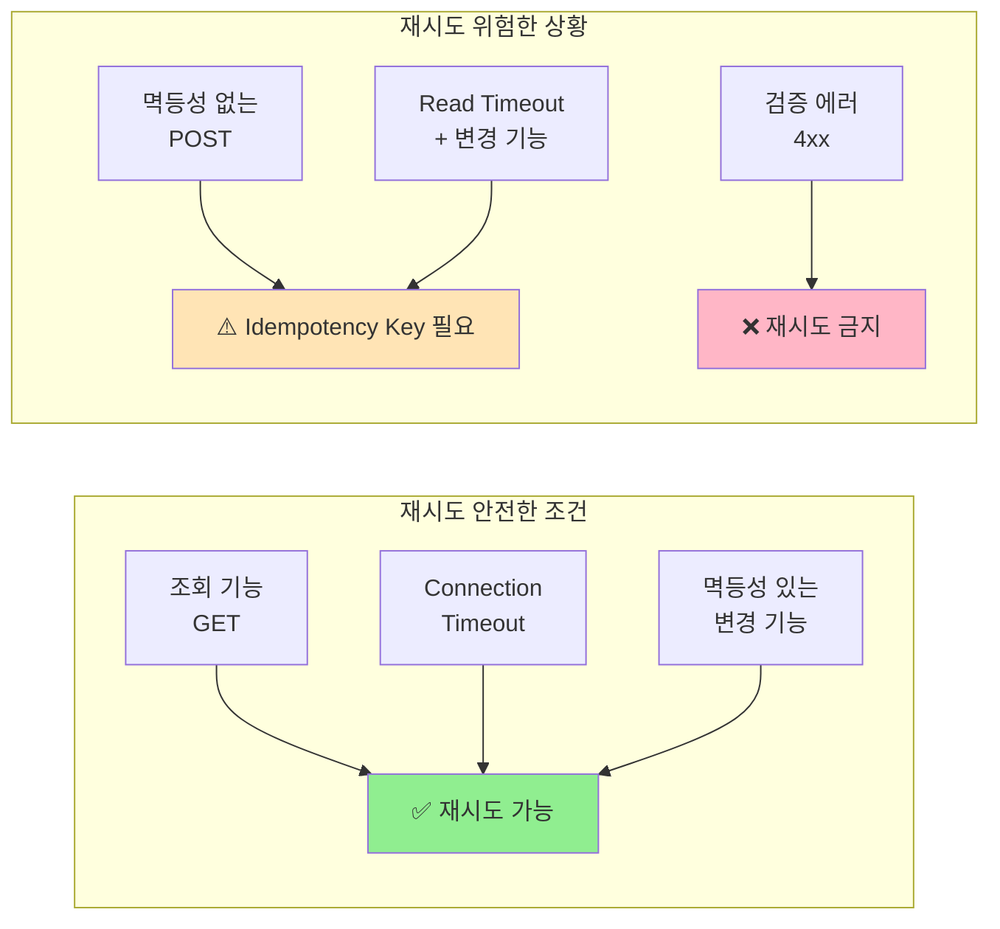
```mermaid
graph LR
    subgraph "재시도 안전한 조건"
        A[조회 기능<br/>GET] --> Safe[✅ 재시도 가능]
        B[Connection<br/>Timeout] --> Safe
        C[멱등성 있는<br/>변경 기능] --> Safe
    end

    subgraph "재시도 위험한 상황"
        D[멱등성 없는<br/>POST] --> Dangerous[⚠️ Idempotency Key 필요]
        E[Read Timeout<br/>+ 변경 기능] --> Dangerous
        F[검증 에러<br/>4xx] --> NoRetry[❌ 재시도 금지]
    end

    style Safe fill:#90EE90
    style Dangerous fill:#FFE4B5
    style NoRetry fill:#FFB6C6
```

#### 3.6.3 재시도 횟수와 간격 설정

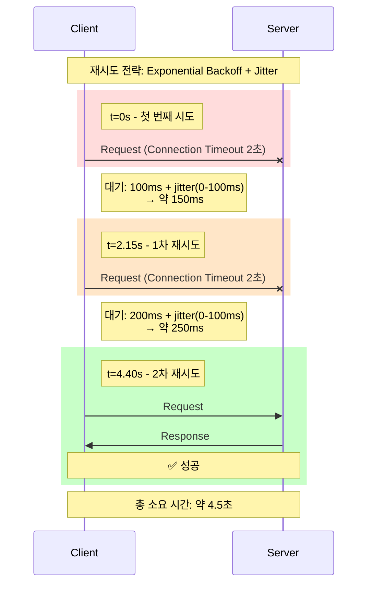
```mermaid
sequenceDiagram
    participant Client
    participant Server

    Note over Client,Server: 재시도 전략: Exponential Backoff + Jitter

    rect rgb(255, 220, 220)
        Note right of Client: t=0s - 첫 번째 시도
        Client-xServer: Request (Connection Timeout 2초)
    end

    Note right of Client: 대기: 100ms + jitter(0-100ms)<br/>→ 약 150ms

    rect rgb(255, 230, 200)
        Note right of Client: t=2.15s - 1차 재시도
        Client-xServer: Request (Connection Timeout 2초)
    end

    Note right of Client: 대기: 200ms + jitter(0-100ms)<br/>→ 약 250ms

    rect rgb(200, 255, 200)
        Note right of Client: t=4.40s - 2차 재시도
        Client->>Server: Request
        Server->>Client: Response
        Note over Client,Server: ✅ 성공
    end

    Note over Client,Server: 총 소요 시간: 약 4.5초
```

**권장 설정**

| 항목             | 권장값                 | 근거                             |
| -------------- | ------------------- | ------------------------------ |
| **재시도 횟수**     | 1-2회                | 3회 이상은 스레드 점유 시간 과다            |
| **Base Delay** | 100-200ms           | 서버 복구/네트워크 재설정 대기              |
| **Backoff 전략** | Exponential (지수 증가) | 1회: 100ms, 2회: 200ms           |
| **Jitter**     | 0-100ms             | 동시 재시도 분산 (Thundering Herd 방지) |

#### 3.6.4 재시도 전략 의사결정 트리

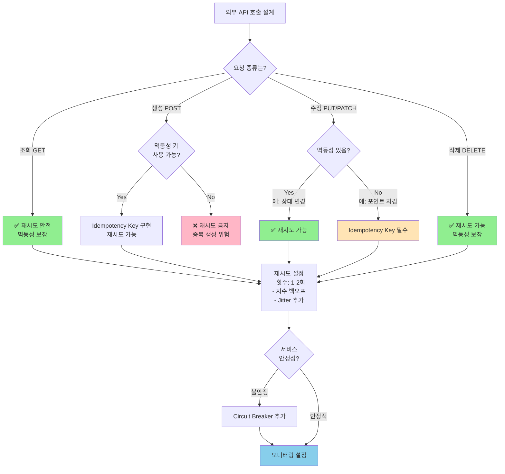
```mermaid
graph TD
    Start[외부 API 호출 설계] --> Q1{요청 종류는?}

    Q1 -->|조회 GET| Safe[✅ 재시도 안전<br/>멱등성 보장]
    Q1 -->|생성 POST| Q2{멱등성 키<br/>사용 가능?}
    Q1 -->|수정 PUT/PATCH| Q3{멱등성 있음?}
    Q1 -->|삭제 DELETE| Safe2[✅ 재시도 가능<br/>멱등성 보장]

    Q2 -->|Yes| Implement1[Idempotency Key 구현<br/>재시도 가능]
    Q2 -->|No| Dangerous1[❌ 재시도 금지<br/>중복 생성 위험]

    Q3 -->|Yes<br/>예: 상태 변경| Safe3[✅ 재시도 가능]
    Q3 -->|No<br/>예: 포인트 차감| Dangerous2[Idempotency Key 필수]

    Safe --> Config[재시도 설정<br/>- 횟수: 1-2회<br/>- 지수 백오프<br/>- Jitter 추가]
    Safe2 --> Config
    Safe3 --> Config
    Implement1 --> Config
    Dangerous2 --> Config

    Config --> CB{서비스<br/>안정성?}
    CB -->|불안정| AddCB[Circuit Breaker 추가]
    CB -->|안정적| Monitor[모니터링 설정]

    AddCB --> Monitor

    style Safe fill:#90EE90
    style Safe2 fill:#90EE90
    style Safe3 fill:#90EE90
    style Dangerous1 fill:#FFB6C6
    style Dangerous2 fill:#FFE4B5
    style Monitor fill:#87CEEB
```
