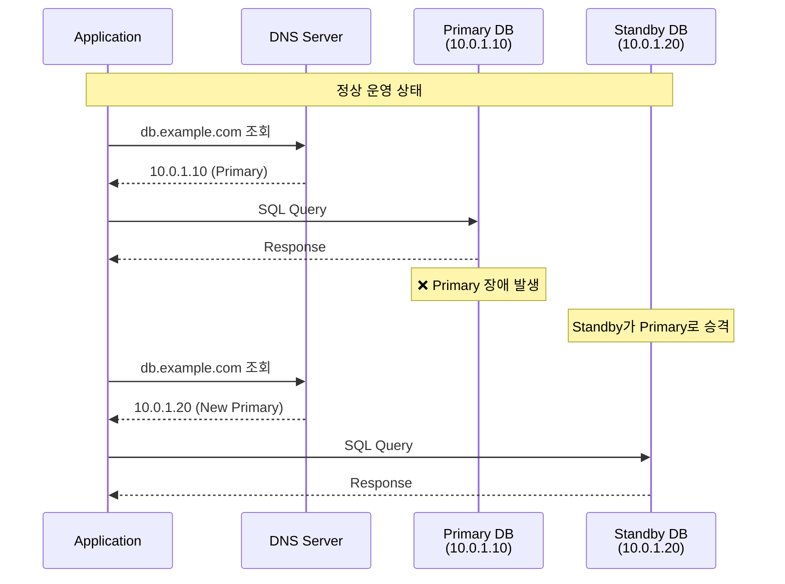
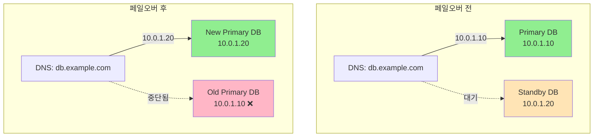
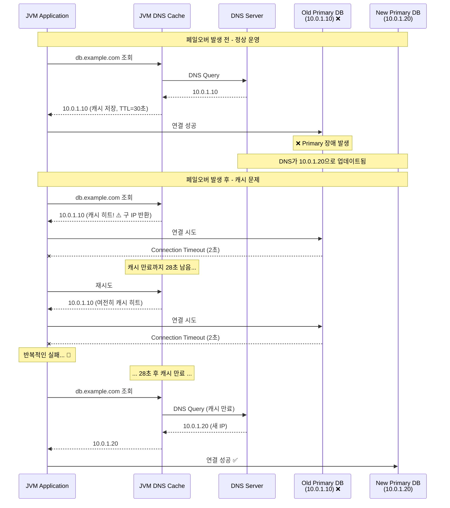
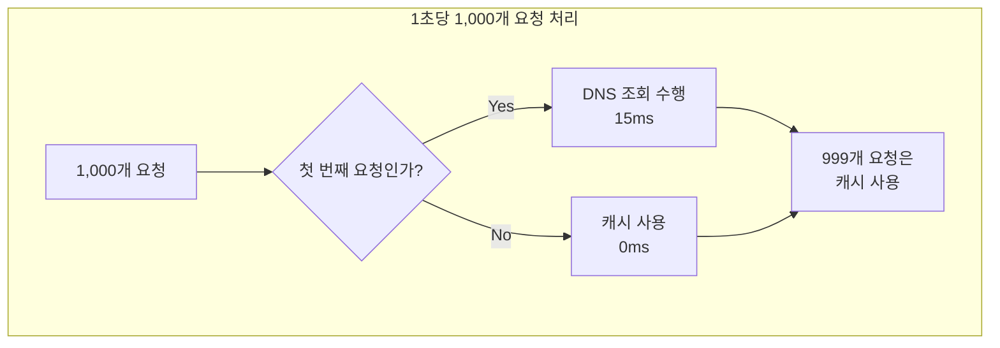
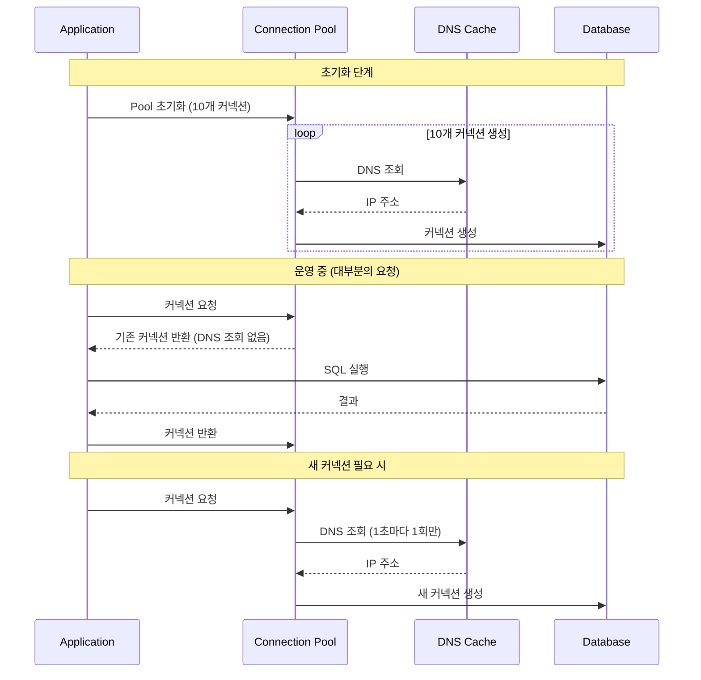

## 4.1 DB 페일오버 시나리오

### Multi-AZ와 Aurora 자동 페일오버

클라우드 환경에서 데이터베이스 고가용성을 위해 Multi-AZ(Multi-Availability Zone) 또는 AWS Aurora와 같은 자동 페일오버 솔루션을 사용한다. 이러한 환경에서는 주 데이터베이스 인스턴스에 장애가 발생하면, 자동으로 대기 인스턴스(Standby)로 전환된다.



### DNS 엔드포인트 기반 접속

대부분의 관리형 데이터베이스는 고정 IP가 아닌 DNS 엔드포인트를 제공한다

- **AWS RDS**: `mydb.123456.us-east-1.rds.amazonaws.com`
- **AWS Aurora**: `mydb-cluster.cluster-123456.us-east-1.rds.amazonaws.com`
- **Google Cloud SQL**: `mydb.project-id.cloudsql.goog`
- **Azure Database**: `mydb.mysql.database.azure.com`

페일오버 발생 시 DNS 레코드가 새로운 Primary 인스턴스의 IP로 업데이트된다.



AWS Aurora의 경우 페일오버는 보통 **60~90초** 이내에 완료된다
1. **장애 감지**: 10~15초
2. **Standby 승격**: 20~30초
3. **DNS 업데이트**: 즉시 (하지만 캐시 문제가 발생)
4. **애플리케이션 복구**: DNS 캐시에 따라 달라짐

---

## 4.2 DNS 캐싱 문제

### JVM DNS 캐시 메커니즘

JVM은 성능 향상을 위해 DNS 조회 결과를 내부적으로 캐싱한다. 이는 네트워크 요청을 줄여주지만, 페일오버 상황에서는 치명적인 문제가 된다.



## 4.3 1초 TTL 설정 권장

### JVM DNS 캐시 TTL 설정 방법

#### 방법 1: 코드로 설정

```java
import java.security.Security;

@Configuration
public class DnsConfig {

    @PostConstruct
    public void configureDnsCache() {
        // 성공한 DNS 조회 결과를 1초간 캐싱
        Security.setProperty("networkaddress.cache.ttl", "1");

        // 실패한 DNS 조회 결과도 1초간 캐싱
        Security.setProperty("networkaddress.cache.negative.ttl", "1");

        // 설정 확인 로깅
        String positiveTtl = Security.getProperty("networkaddress.cache.ttl");
        String negativeTtl = Security.getProperty("networkaddress.cache.negative.ttl");

        log.info("DNS Cache TTL configured - Positive: {}s, Negative: {}s",
                 positiveTtl, negativeTtl);
    }
}
```

#### 방법 2: JVM 시스템 프로퍼티

```bash
java -Dsun.net.inetaddr.ttl=1 \
     -Dsun.net.inetaddr.negative.ttl=1 \
     -jar myapp.jar
```


---

## 4.4 1초 TTL의 성능 영향

### 성능 영향 시뮬레이션

**시나리오**: 초당 1,000 요청을 처리하는 애플리케이션



**결론**: TTL=1초 설정은 **실질적인 성능 영향이 거의 없다**.

- 1초에 1번만 실제 DNS 조회 발생
- 나머지 999번의 요청은 캐시 사용
- 평균 추가 지연: **0.015ms/요청** (무시 가능한 수준)

### Connection Pool과의 관계

데이터베이스 커넥션 풀을 사용하는 경우, DNS 조회는 **새로운 커넥션을 생성할 때만** 발생한다.


