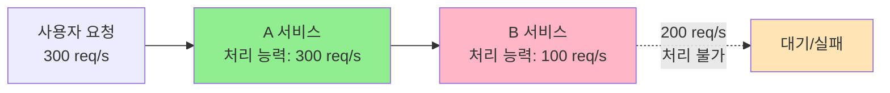
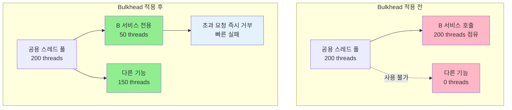
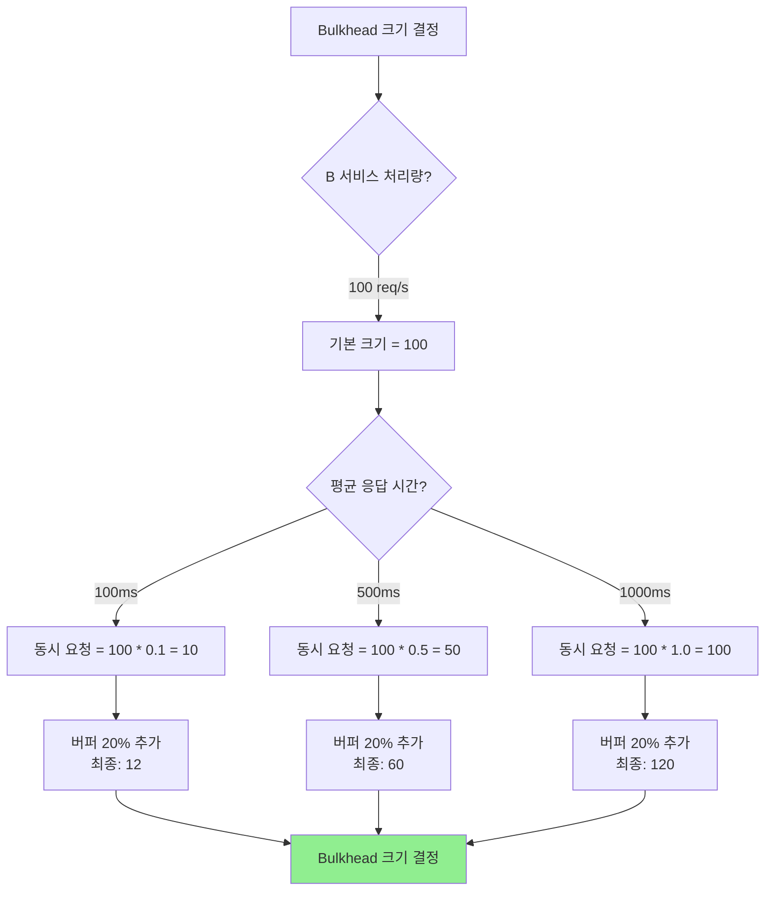
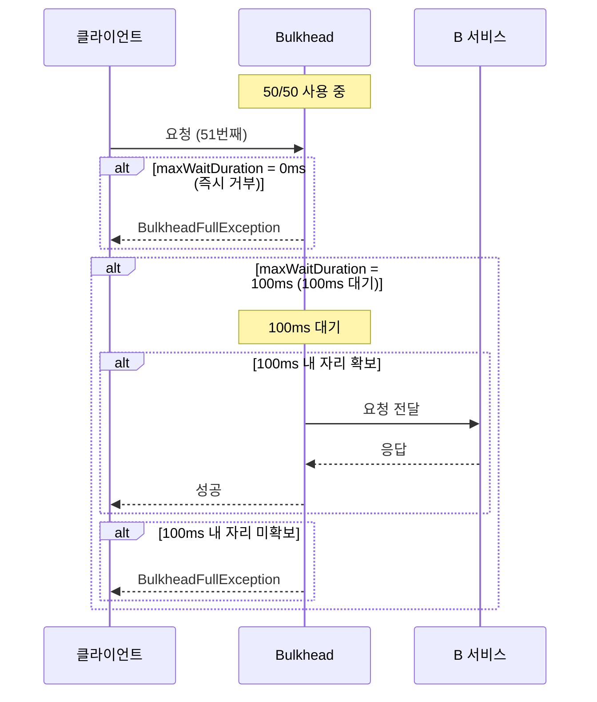

## 5.1 문제 상황: 처리량 불균형

### 시나리오



**현상**
- A 서비스는 초당 300개의 요청을 처리할 수 있다
- B 서비스는 초당 100개의 요청만 처리할 수 있다
- A 서비스로 300개의 요청이 유입되면 200개는 B 서비스에서 실패하거나 대기한다

**문제점**

1. **스레드 풀 고갈**
   ```mermaid
   sequenceDiagram
       participant User as 사용자
       participant A as A 서비스<br/>(스레드 풀: 200)
       participant B as B 서비스

       Note over A: 300개 요청 수신

       loop 300번 반복
           User->>A: 요청
           A->>B: 요청 전달
       end

       Note over B: 100개만 처리 가능
       Note over B: 200개는 지연 응답

       Note over A: 200개 스레드가<br/>B의 응답 대기 중
       Note over A: ⚠️ 스레드 풀 고갈
       Note over A: 새 요청 처리 불가
   ```

2. **연쇄 장애**
   - A 서비스의 스레드가 B 서비스 응답을 기다리며 블로킹됨
   - A 서비스의 다른 기능까지 영향을 받음
   - 전체 시스템 가용성 저하

3. **리소스 낭비**
   - 처리될 수 없는 요청이 스레드를 점유
   - B 서비스에 불필요한 부하 전달

---

## 5.2 Bulkhead 패턴

### 개념

**Bulkhead(격벽)**: 선박의 구획을 나누는 칸막이처럼, 시스템의 리소스를 격리하여 장애가 전파되는 것을 방지한다.



### 핵심 원리

1. **리소스 격리**: B 서비스 호출을 위한 전용 스레드 풀 할당
2. **빠른 실패(Fail Fast)**: 용량 초과 시 즉시 에러 응답
3. **장애 격리**: B 서비스 문제가 A 서비스 전체로 전파되지 않음

---

## 5.3 Bulkhead 구현 방법

### 5.3.1 Resilience4j Bulkhead

Resilience4j는 두 가지 Bulkhead 타입을 제공한다:

1. **Semaphore-based**: 동시 호출 수 제한
2. **Thread Pool-based**: 별도 스레드 풀 사용

#### Semaphore-based Bulkhead

**장점**:
- 가벼움 (스레드 풀 생성 불필요)
- Context Switching 오버헤드 없음
- Spring WebFlux와 호환

**단점**:
- 호출하는 스레드를 블로킹함

```java
@Configuration
public class BulkheadConfig {

    @Bean
    public Bulkhead bServiceBulkhead() {
        BulkheadConfig config = BulkheadConfig.custom()
            .maxConcurrentCalls(50)              // 최대 동시 호출: 50개
            .maxWaitDuration(Duration.ofMillis(100))  // 대기 시간: 100ms
            .build();

        return Bulkhead.of("bService", config);
    }
}
```

```java
@Service
public class AService {

    private final Bulkhead bulkhead;
    private final WebClient webClient;

    public Mono<String> callBService(String request) {
        return Mono.fromCallable(() ->
            Bulkhead.decorateCallable(bulkhead, () ->
                webClient.post()
                    .uri("http://b-service/api")
                    .bodyValue(request)
                    .retrieve()
                    .bodyToMono(String.class)
                    .block()  // Semaphore 기반이므로 block 가능
            ).call()
        )
        .onErrorResume(BulkheadFullException.class, e -> {
            // Bulkhead가 가득 찬 경우
            log.warn("B 서비스 Bulkhead 포화: {}", e.getMessage());
            return Mono.just("서비스 혼잡, 잠시 후 재시도해주세요.");
        });
    }
}
```

#### Thread Pool-based Bulkhead

**장점**:
- 완전한 격리 (별도 스레드 풀)
- 호출하는 스레드를 블로킹하지 않음

**단점**:
- 스레드 풀 생성 오버헤드
- Context Switching 비용

```java
@Configuration
public class ThreadPoolBulkheadConfig {

    @Bean
    public ThreadPoolBulkhead bServiceThreadPoolBulkhead() {
        ThreadPoolBulkheadConfig config = ThreadPoolBulkheadConfig.custom()
            .maxThreadPoolSize(50)               // 최대 스레드: 50개
            .coreThreadPoolSize(25)              // 코어 스레드: 25개
            .queueCapacity(100)                  // 대기 큐: 100개
            .keepAliveDuration(Duration.ofMillis(1000))
            .build();

        return ThreadPoolBulkhead.of("bService", config);
    }
}
```

```java
@Service
public class AService {

    private final ThreadPoolBulkhead threadPoolBulkhead;
    private final WebClient webClient;

    public CompletableFuture<String> callBService(String request) {
        Supplier<String> supplier = () ->
            webClient.post()
                .uri("http://b-service/api")
                .bodyValue(request)
                .retrieve()
                .bodyToMono(String.class)
                .block();

        return threadPoolBulkhead.executeSupplier(supplier)
            .exceptionally(throwable -> {
                if (throwable instanceof BulkheadFullException) {
                    log.warn("B 서비스 ThreadPool 포화");
                    return "서비스 혼잡, 잠시 후 재시도해주세요.";
                }
                throw new RuntimeException(throwable);
            });
    }
}
```

---


## 5.4 용량 계산 및 설정 가이드

### 5.4.1 Bulkhead 크기 결정



**계산 공식**:

```
동시 요청 수 = (처리량) × (평균 응답 시간(초))
Bulkhead 크기 = 동시 요청 수 × 1.2  (20% 버퍼)
```

**예시**

| B 서비스 처리량 | 평균 응답 시간     | 동시 요청 수 | Bulkhead 크기 |
| --------- | ------------ | ------- | ----------- |
| 100 req/s | 100ms (0.1s) | 10      | 12          |
| 100 req/s | 500ms (0.5s) | 50      | 60          |
| 100 req/s | 1000ms (1s)  | 100     | 120         |
| 50 req/s  | 200ms (0.2s) | 10      | 12          |

### 5.4.2 대기 시간(maxWaitDuration) 설정



**권장 설정**

| 시나리오 | maxWaitDuration | 이유 |
|---------|----------------|------|
| **고속 응답 API** | 0ms | 즉시 실패, 빠른 피드백 |
| **일반 API** | 50~100ms | 짧은 대기로 일시적 혼잡 흡수 |
| **배치 작업** | 500ms~1s | 긴 대기 허용 |
| **실시간 서비스** | 0ms | 지연 불가 |
