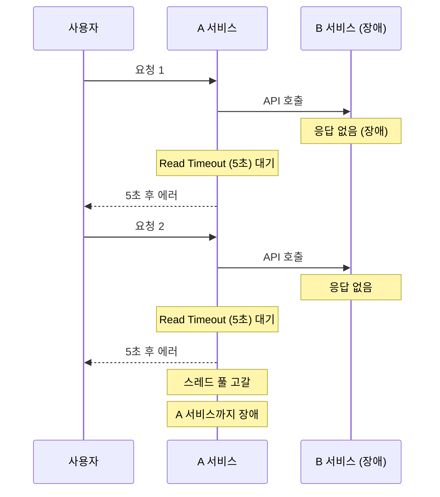
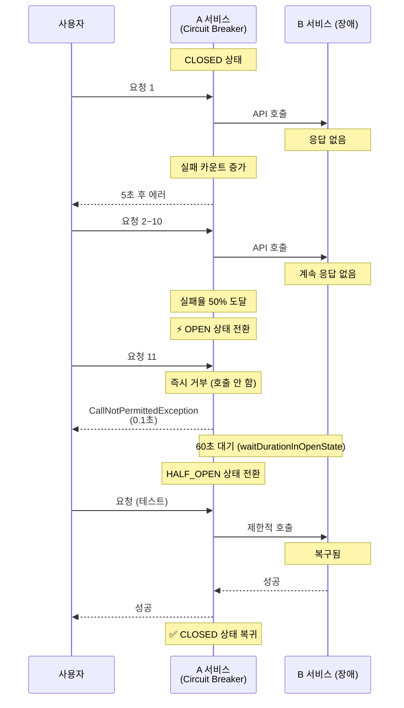
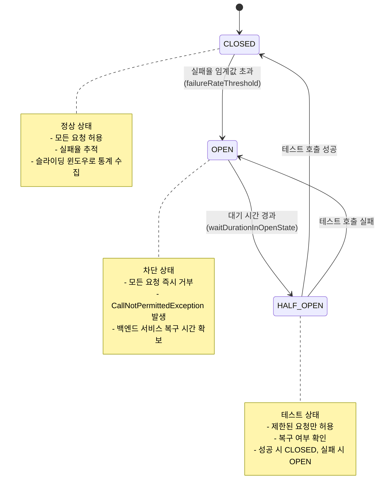

## Circuit Breaker가 필요한 이유

### 문제 상황: 장애 전파



**문제점**

1. **불필요한 재시도**: 장애가 명백한데도 계속 호출 시도
2. **리소스 낭비**: 실패할 요청에 스레드와 시간 소비
3. **장애 전파**: B 서비스 장애가 A 서비스로 확산
4. **복구 지연**: B 서비스가 복구되어도 계속되는 부하로 재장애

### Circuit Breaker의 해결책



**효과**

1. **빠른 실패(Fail Fast)**: 장애 서비스 호출 중단, 즉시 에러 반환
2. **리소스 보호**: 스레드와 시간 낭비 방지
3. **장애 격리**: A 서비스 정상 동작 유지
4. **자동 복구 시도**: 일정 시간 후 자동으로 재시도

---

## Circuit Breaker 상태 머신



### 상태별 동작

#### 1. CLOSED (정상)

- **동작**: 모든 요청을 백엔드로 전달
- **추적**: 슬라이딩 윈도우로 성공/실패율 기록
- **전환 조건**: 실패율이 임계값 초과 시 OPEN으로 전환

```java
// CLOSED 상태에서의 동작
if (circuitBreaker.getState() == CLOSED) {
    try {
        Result result = backendService.call();
        circuitBreaker.recordSuccess();  // 성공 기록
        return result;
    } catch (Exception e) {
        circuitBreaker.recordFailure();  // 실패 기록

        // 실패율 계산 (슬라이딩 윈도우 기반)
        if (failureRate > failureRateThreshold) {
            circuitBreaker.transitionToOpen();  // OPEN 전환
        }
        throw e;
    }
}
```

#### 2. OPEN (차단)

- **동작**: 모든 요청을 즉시 거부 (백엔드 호출 안 함)
- **예외**: `CallNotPermittedException` 발생
- **전환 조건**: `waitDurationInOpenState` 시간 경과 후 HALF_OPEN으로 전환

```java
// OPEN 상태에서의 동작
if (circuitBreaker.getState() == OPEN) {
    // 백엔드 호출 없이 즉시 거부
    throw new CallNotPermittedException("Circuit Breaker is OPEN");
}

// 일정 시간 후 자동 전환
if (System.currentTimeMillis() - openStateStartTime > waitDurationInOpenState) {
    circuitBreaker.transitionToHalfOpen();
}
```

#### 3. HALF_OPEN (테스트)

- **동작**: 제한된 수의 요청만 허용 (`permittedNumberOfCallsInHalfOpenState`)
- **목적**: 백엔드 서비스 복구 여부 확인
- **전환 조건**:
  - 테스트 호출 성공 → CLOSED
  - 실패율 임계값 초과 → OPEN

```java
// HALF_OPEN 상태에서의 동작
if (circuitBreaker.getState() == HALF_OPEN) {
    if (callsInHalfOpenState < permittedNumberOfCallsInHalfOpenState) {
        try {
            Result result = backendService.call();
            circuitBreaker.recordSuccess();
            callsInHalfOpenState++;

            // 모든 테스트 호출 성공 시
            if (allCallsSuccessful()) {
                circuitBreaker.transitionToClosed();  // CLOSED 전환
            }
            return result;
        } catch (Exception e) {
            circuitBreaker.recordFailure();
            circuitBreaker.transitionToOpen();  // 다시 OPEN
            throw e;
        }
    } else {
        // 허용된 호출 수 초과
        throw new CallNotPermittedException("Too many calls in HALF_OPEN");
    }
}
```

---

## Resilience4j 주요 프로퍼티

```yaml
resilience4j:
  circuitbreaker:
    instances:
      bService:
        # 1. 슬라이딩 윈도우 설정
        sliding-window-type: COUNT_BASED          # COUNT_BASED | TIME_BASED
        sliding-window-size: 100                  # 최근 100개 호출 추적
        minimum-number-of-calls: 10               # 최소 10개 호출 후 통계 계산

        # 2. 실패 임계값
        failure-rate-threshold: 50                # 실패율 50% 초과 시 OPEN
        slow-call-rate-threshold: 50              # 느린 호출 50% 초과 시 OPEN
        slow-call-duration-threshold: 2s          # 2초 이상이면 "느린 호출"

        # 3. OPEN 상태 설정
        wait-duration-in-open-state: 60s          # OPEN → HALF_OPEN 전환 대기 시간

        # 4. HALF_OPEN 상태 설정
        permitted-number-of-calls-in-half-open-state: 10  # 테스트 호출 수

        # 5. 예외 처리
        record-exceptions:                        # 실패로 기록할 예외
          - java.io.IOException
          - java.util.concurrent.TimeoutException
        ignore-exceptions:                        # 무시할 예외 (통계에서 제외)
          - com.example.BusinessException
```
