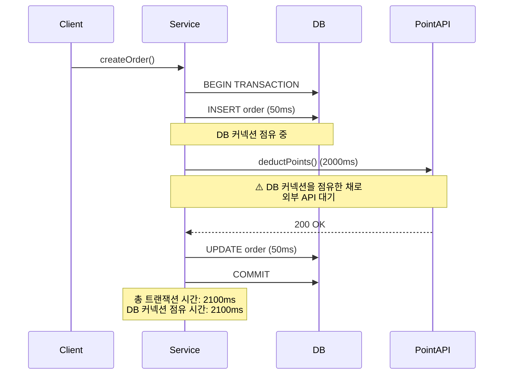
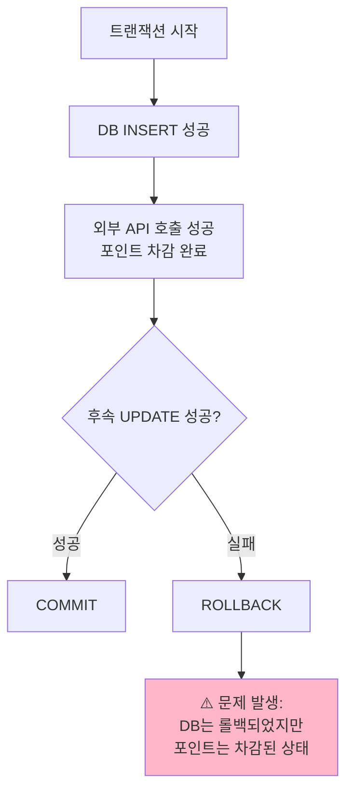
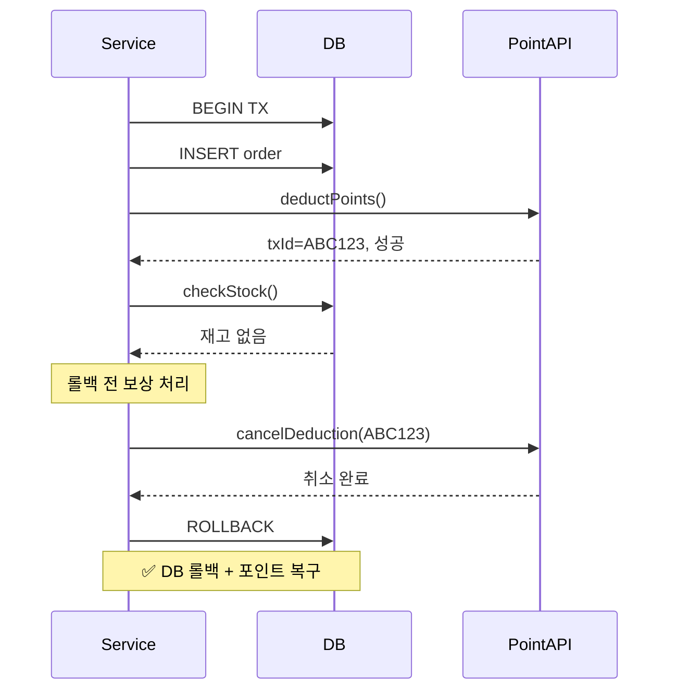
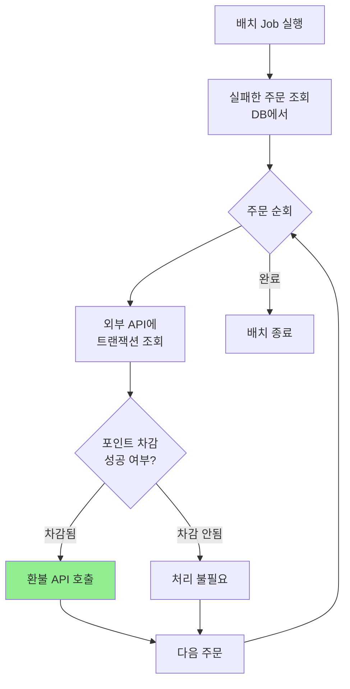
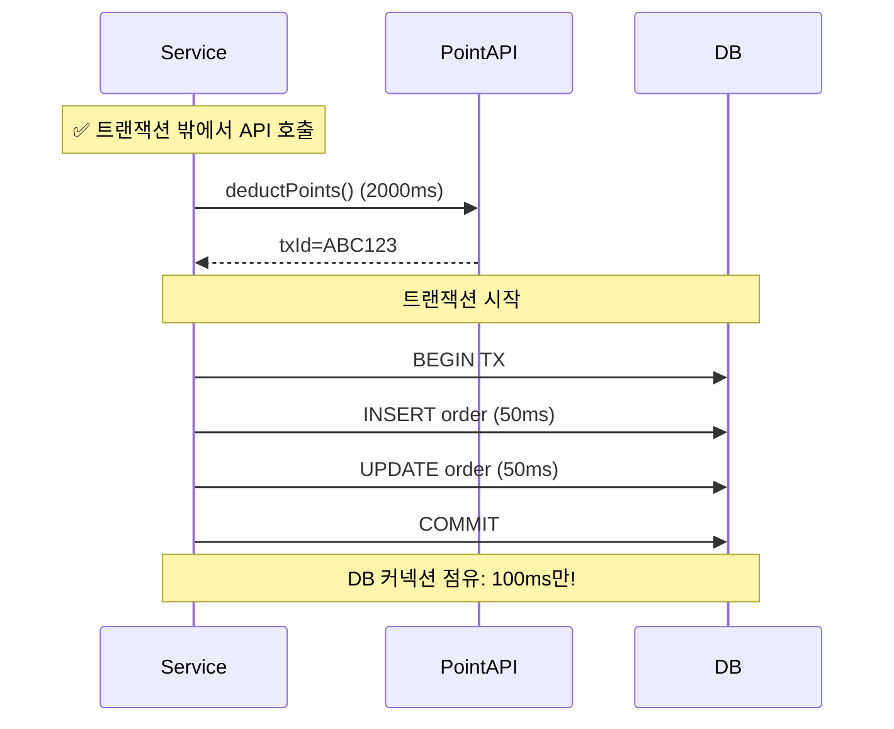
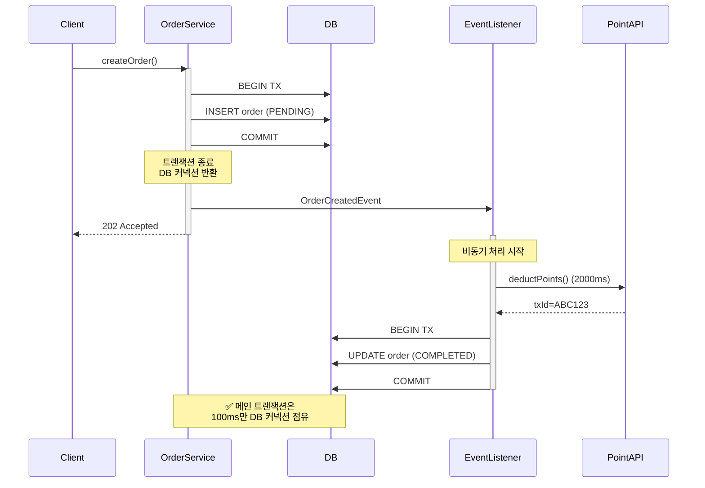
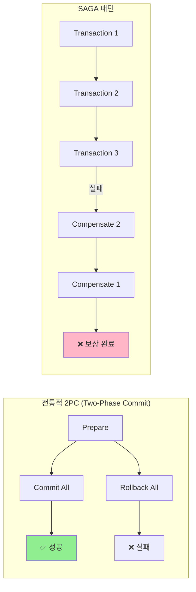
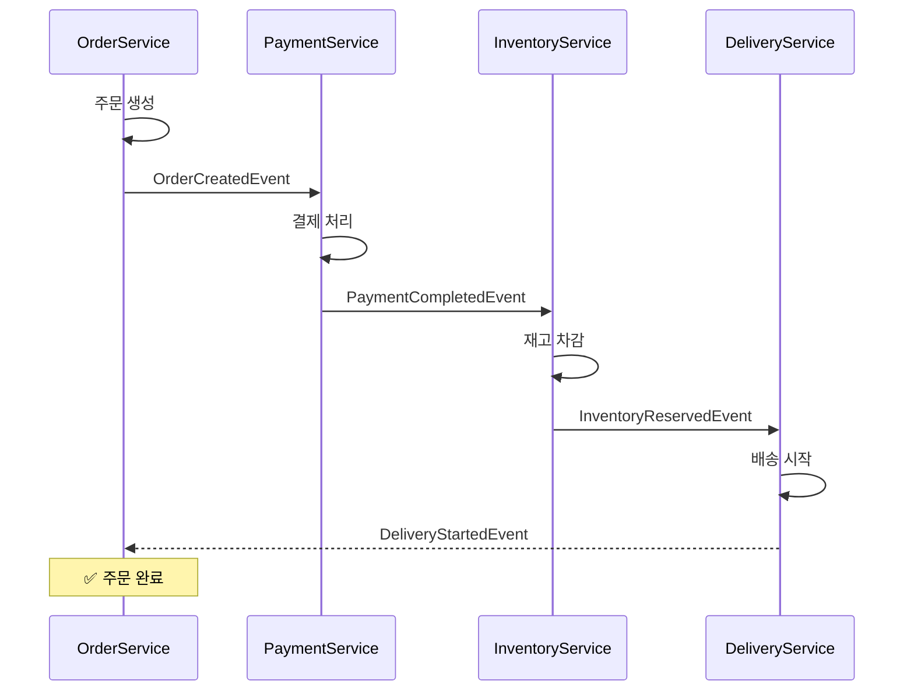
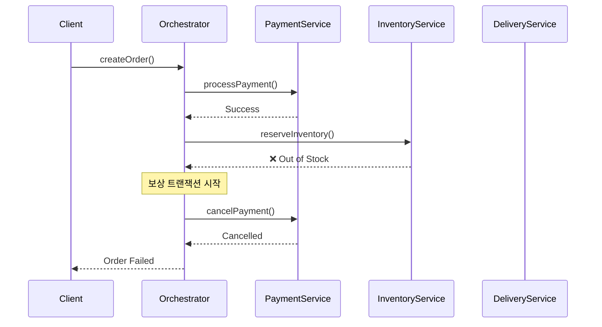

## 문제 상황: 트랜잭션과 외부 API 호출

### 전형적인 안티패턴

```java
@Service
@Transactional
public class OrderService {

    private final OrderRepository orderRepository;
    private final PointApiClient pointApiClient;

    public void createOrder(OrderRequest request) {
        // 1. DB 쿼리 (트랜잭션 시작)
        Order order = new Order(request);
        orderRepository.save(order);  // 50ms

        // 2. 외부 API 호출 (트랜잭션 중)
        pointApiClient.deductPoints(request.getUserId(), request.getPoints());  // 500ms~3000ms

        // 3. DB 쿼리 (트랜잭션 종료 전)
        order.completePayment();
        orderRepository.save(order);  // 50ms

        // 트랜잭션 커밋
    }
}
```

### 무엇이 문제인가?



### 문제점

1. **DB 커넥션 풀 고갈**
   - 외부 API 응답 시간(500ms~3000ms) 동안 DB 커넥션 점유
   - HikariCP 기본 설정(max-pool-size=10)에서 10개의 요청만 처리되면 풀 고갈
   - 이후 요청은 `Connection timeout` 발생

2. **롤백 처리 복잡성**



---

## 시나리오별 대응 전략

### 시나리오 1: API 실패 → 트랜잭션 롤백

```java
@Service
@Transactional
public class OrderService {

    public void createOrder(OrderRequest request) {
        // 1. DB 쿼리
        Order order = new Order(request);
        orderRepository.save(order);

        try {
            // 2. 외부 API 호출
            pointApiClient.deductPoints(request.getUserId(), request.getPoints());
        } catch (PointApiException e) {
            // 3. API 실패 → RuntimeException 발생 → 트랜잭션 롤백
            throw new OrderException("포인트 차감 실패", e);
        }

        // 4. 후속 작업
        order.completePayment();
        orderRepository.save(order);
    }
}
```

### 시나리오 2: API 성공 → 후속 트랜잭션 실패 → 롤백

```java
@Service
@Transactional
public class OrderService {

    public void createOrder(OrderRequest request) {
        // 1. DB 쿼리 성공
        Order order = new Order(request);
        orderRepository.save(order);

        // 2. 외부 API 호출 성공 (포인트 차감됨!)
        pointApiClient.deductPoints(request.getUserId(), request.getPoints());

        // 3. 후속 쿼리 실패
        if (inventoryRepository.checkStock(request.getProductId()) == 0) {
            throw new OutOfStockException("재고 부족");
            // ⚠️ 트랜잭션 롤백되지만 포인트는 이미 차감된 상태!
        }

        order.completePayment();
        orderRepository.save(order);
    }
}
```

### **해결 방법 3가지**

#### 방법 1: 보상 API 호출 (Compensating Transaction)

```java
@Service
@Transactional
public class OrderService {

    private final PointApiClient pointApiClient;

    public void createOrder(OrderRequest request) {
        Order order = new Order(request);
        orderRepository.save(order);

        String transactionId = null;
        try {
            // 외부 API 호출 (트랜잭션 ID 반환)
            transactionId = pointApiClient.deductPoints(
                request.getUserId(),
                request.getPoints()
            );

            // 후속 작업
            if (inventoryRepository.checkStock(request.getProductId()) == 0) {
                throw new OutOfStockException("재고 부족");
            }

            order.completePayment();
            orderRepository.save(order);

        } catch (Exception e) {
            // 롤백 전에 보상 API 호출
            if (transactionId != null) {
                try {
                    pointApiClient.cancelDeduction(transactionId);  // 취소 API
                } catch (Exception compensationError) {
                    log.error("보상 트랜잭션 실패: {}", transactionId, compensationError);
                    // 별도 보상 처리 필요 (배치 Job 등)
                }
            }
            throw e;
        }
    }
}
```



#### 방법 2: 조회 API로 상태 확인

```java
@Service
public class PointReconciliationService {

    private final PointApiClient pointApiClient;

    @Scheduled(fixedDelay = 60000)  // 1분마다
    public void reconcileFailedOrders() {
        // DB에서 "결제 실패" 상태의 주문 조회
        List<Order> failedOrders = orderRepository.findByStatus(OrderStatus.PAYMENT_FAILED);

        for (Order order : failedOrders) {
            try {
                // 포인트 차감 내역 조회
                PointTransaction pointTx = pointApiClient.getTransaction(order.getTransactionId());

                if (pointTx.isSuccess()) {
                    // 포인트는 차감되었는데 주문은 실패 → 환불 필요
                    pointApiClient.refund(order.getTransactionId());
                    log.warn("불일치 해소: 주문 {} 포인트 환불 완료", order.getId());
                }
            } catch (Exception e) {
                log.error("정합성 체크 실패: {}", order.getId(), e);
            }
        }
    }
}
```



#### 방법 3: 멱등성 보장 API + 재시도

외부 API가 멱등성을 보장하는 경우:

```java
@Service
@Transactional
public class OrderService {

    public void createOrder(OrderRequest request) {
        // 1. 주문 생성 (idempotency key 포함)
        Order order = new Order(request);
        String idempotencyKey = UUID.randomUUID().toString();
        order.setIdempotencyKey(idempotencyKey);
        orderRepository.save(order);

        // 2. 외부 API 호출 (멱등성 보장)
        pointApiClient.deductPointsIdempotent(
            idempotencyKey,              // 동일 키로 여러 번 호출해도 1번만 처리됨
            request.getUserId(),
            request.getPoints()
        );

        // 3. 재고 체크
        if (inventoryRepository.checkStock(request.getProductId()) == 0) {
            throw new OutOfStockException("재고 부족");
            // 롤백되지만, 재시도 시 동일한 idempotencyKey로 호출하므로
            // 포인트는 중복 차감되지 않음
        }

        order.completePayment();
        orderRepository.save(order);
    }
}
```

---

## DB 커넥션 풀 고갈 문제

### 문제 시나리오

```java
@Service
@Transactional  // ⚠️ 트랜잭션 범위가 너무 넓음
public class OrderService {

    public void createOrder(OrderRequest request) {
        // DB 커넥션 점유 시작
        Order order = new Order(request);
        orderRepository.save(order);  // 50ms

        // ⚠️ 외부 API 호출 (DB 커넥션 점유 유지)
        pointApiClient.deductPoints(...);  // 500ms~3000ms

        order.completePayment();
        orderRepository.save(order);  // 50ms

        // DB 커넥션 반환 (총 점유 시간: 600ms~3100ms)
    }
}
```

**커넥션 풀 고갈 시뮬레이션**:

```mermaid
gantt
    title DB 커넥션 풀 고갈 (max-pool-size=10)
    dateFormat X
    axisFormat %L ms

    section Conn1
    TX1: 0, 2000

    section Conn2
    TX2: 100, 2100

    section Conn3
    TX3: 200, 2200

    section Conn4
    TX4: 300, 2300

    section Conn5
    TX5: 400, 2400

    section Conn6
    TX6: 500, 2500

    section Conn7
    TX7: 600, 2600

    section Conn8
    TX8: 700, 2700

    section Conn9
    TX9: 800, 2800

    section Conn10
    TX10: 900, 2900

    section 대기
    ❌ 11번째 요청 대기: 1000, 2000
```



### 해결 방법: 트랜잭션 분리

#### 방법 1: 외부 API를 트랜잭션 밖으로 분리

```java
@Service
public class OrderService {

    private final OrderRepository orderRepository;
    private final PointApiClient pointApiClient;

    public void createOrder(OrderRequest request) {
        // 1. 트랜잭션 없이 외부 API 먼저 호출
        String pointTxId = pointApiClient.deductPoints(
            request.getUserId(),
            request.getPoints()
        );

        try {
            // 2. 트랜잭션 시작 (짧게 유지)
            createOrderInTransaction(request, pointTxId);

        } catch (Exception e) {
            // 3. 실패 시 보상 처리
            try {
                pointApiClient.cancelDeduction(pointTxId);
            } catch (Exception compensationError) {
                log.error("보상 실패: {}", pointTxId, compensationError);
                // 배치 Job으로 후처리
            }
            throw e;
        }
    }

    @Transactional  // ✅ 짧은 트랜잭션
    private void createOrderInTransaction(OrderRequest request, String pointTxId) {
        Order order = new Order(request);
        order.setPointTransactionId(pointTxId);
        orderRepository.save(order);

        if (inventoryRepository.checkStock(request.getProductId()) == 0) {
            throw new OutOfStockException("재고 부족");
        }

        order.completePayment();
        orderRepository.save(order);
    }
}
```

**개선 효과**:

| 구분 | Before | After |
|-----|--------|-------|
| **DB 커넥션 점유 시간** | 2100ms | 100ms |
| **TPS (max-pool-size=10)** | ~5 TPS | ~100 TPS |
| **동시 처리 가능 요청 수** | 10개 | 200개 |



#### 방법 2: 비동기 처리 + 이벤트 기반

```java
@Service
public class OrderService {

    private final ApplicationEventPublisher eventPublisher;

    @Transactional
    public void createOrder(OrderRequest request) {
        // 1. 주문 생성 (DB만)
        Order order = new Order(request);
        order.setStatus(OrderStatus.PENDING_PAYMENT);
        orderRepository.save(order);

        // 2. 이벤트 발행
        eventPublisher.publishEvent(new OrderCreatedEvent(order.getId(), request));
    }
}

@Component
@Slf4j
public class OrderEventListener {

    private final PointApiClient pointApiClient;
    private final OrderRepository orderRepository;

    @Async("asyncExecutor")
    @TransactionalEventListener(phase = TransactionPhase.AFTER_COMMIT)
    public void handleOrderCreated(OrderCreatedEvent event) {
        try {
            // 3. 비동기로 외부 API 호출 (DB 커넥션 점유 없음)
            String pointTxId = pointApiClient.deductPoints(
                event.getUserId(),
                event.getPoints()
            );

            // 4. 결제 완료 처리 (새로운 트랜잭션)
            completePayment(event.getOrderId(), pointTxId);

        } catch (Exception e) {
            log.error("결제 처리 실패: {}", event.getOrderId(), e);
            // 재시도 또는 보상 처리
            markOrderAsFailed(event.getOrderId());
        }
    }

    @Transactional
    private void completePayment(Long orderId, String pointTxId) {
        Order order = orderRepository.findById(orderId)
            .orElseThrow();
        order.setPointTransactionId(pointTxId);
        order.setStatus(OrderStatus.COMPLETED);
        orderRepository.save(order);
    }

    @Transactional
    private void markOrderAsFailed(Long orderId) {
        Order order = orderRepository.findById(orderId)
            .orElseThrow();
        order.setStatus(OrderStatus.FAILED);
        orderRepository.save(order);
    }
}
```




---

## SAGA 패턴 소개

### SAGA 패턴이란?

분산 트랜잭션에서 일관성을 유지하기 위해 **보상 트랜잭션(Compensating Transaction)**을 사용하는 패턴이다.



### SAGA 패턴 유형

#### 1. Choreography (코레오그래피) - 이벤트 기반

각 서비스가 **이벤트**를 발행하고, 다른 서비스가 이를 구독하여 처리한다.



**장점**:
- 서비스 간 결합도 낮음
- 확장성이 좋음

**단점**:
- 전체 흐름 파악 어려움
- 디버깅 복잡


#### 2. Orchestration (오케스트레이션) - 중앙 제어

**Orchestrator**가 전체 트랜잭션 흐름을 제어한다.



**장점**:
- 전체 흐름을 한 곳에서 관리
- 디버깅 쉬움
- 보상 로직이 명확

**단점**:
- Orchestrator가 단일 장애점(SPOF)
- 서비스 간 결합도 증가
