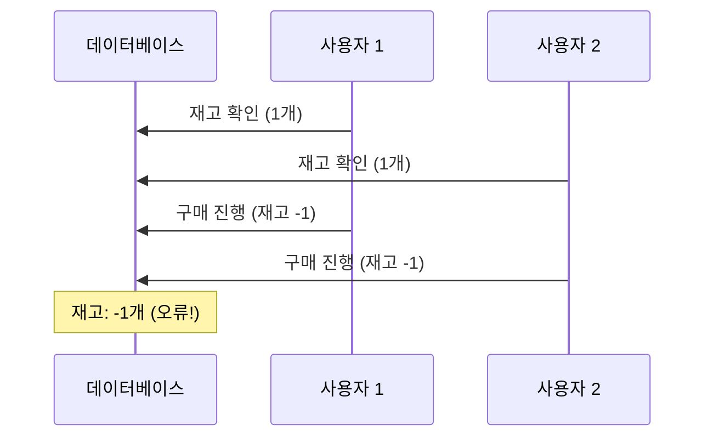

### 동시성 이슈란?

- 동시성 이슈는 여러 스레드나 프로세스가 동시에 공유 자원에 접근할 때 발생하는 문제
- 이로 인해 데이터 불일치, 예상치 못한 동작, 시스템 오류 등이 발생할 수 있습니다.

### 동시성 이슈가 발생하는 주요 원인

- 공유 자원에 대한 동시 접근
    - 여러 스레드가 동일한 메모리 영역이나 파일에 동시에 접근하여 읽기/쓰기 작업을 수행할 때
- Race Condition (경쟁 상태)
    - 두 개 이상의 스레드가 공유 데이터를 동시에 수정하려고 할 때, 실행 순서에 따라 결과가 달라지는 상황
    - 예를 들어 스레드 A,B,C가 값을 각각 3,2,1로 수정하려고 할때 실행 순서에 따라 동시성 이슈가 발생 가능
- 가시성(Visibility) 문제
    - 한 스레드가 변경한 값이 다른 스레드에게 즉시 보이지 않는 문제
    - CPU 로컬 캐시같은 곳에는 갱신되어 있으나 메모리에는 갱신되어 있지 않아 잘못 값을 읽는 경우

### 재고 관리 시스템

여러 사용자가 동시에 마지막 남은 상품을 구매하려고 할 때:



- 154p에서 저자는 멀티스레드 환경에서 필드에 데이터를 저장할때 동시성 문제를 겪음
    - Spring은 멀티 스레드에서 안전한지 생각해봐야 함

### Spring에서 빈은 멀티 스레드에서 안전한가?

- Spring Bean은 싱글톤으로 만들어져 객체를 재활용하고 있기에 안전하지 않을 가능성이 높음
- 일반적으로 Spring Bean을 Statless하게 설계하기 때문에 멀티 스레드에서 안전
- 만약 멤버 변수에 데이터를 변화시키는 코드가 있다면 더 이상 Stateless한 설계가 아님
    - 멤버 변수같은 곳에 데이터를 저장하면 멀티 스레드에서 안전하지 않음

```java
@Service
public class UserService {
		private static final Integer findCount = 0;

    public User getUser(Long id) {
		    // 비즈니스 로직

		    findCount++;
    }
}
```