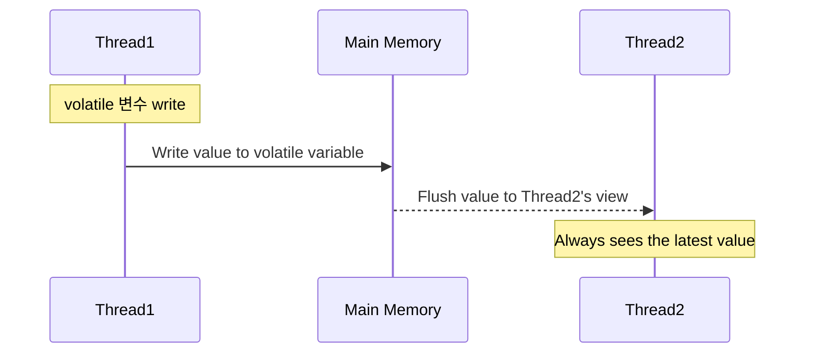
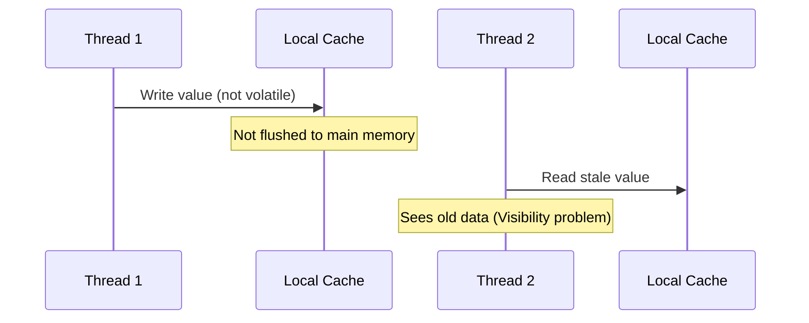

### 잠금(lock)을 이용한 접근 제어

- 프로세스 수준에서 데이터를 동시에 수정하는 것을 막기 위한 방법으로 잠금을 사용
- 잠금을 사용할 때는 모든 영역에 잠금을 하는 것이 아닌 임계 영역에만 잠금을 거는것이 효율적
    - 임계영역은 동시에 둘 이상의 스레드나 프로세스가 접근하면 안되는 공유 자원에 접근하는 코드를 말함

### synchronized와 ReentrantLock

- synchronized와 ReentrantLock 모두 Lock을 지원하지만 ReentrantLock에 부가적인 기능이 많음
- Java 21에 추가된 가상 스레드는 아직 ReentrantLock만 지원하고 synchornized는 24부터 지원

### Mutex, Semaphore

- Java에서 Mutex는 클래스명에 Lock이 포함되어 있음
- Semaphore를 통해 동시에 실행할 수 있는 스레드 개수에 제한을 줄 수 있음

### synchronized

- synchronized 모니터 락을 통해 동기화를 지원
- OS에서 제공해주는 뮤텍스와 C++로 구현된 ObjectMonitor를 통해서 락을 관리
- synchronized에도 락의 종류가 존재함
    - OS에서 제공하는 락을 사용하면 user ↔ kernel 영역간 전환으로 인한 오버헤드 발생 최적화를 위해서
    - Java Object Header 개념을 알아야 하는데 간략하게 객체 헤더, Mark word, Class word 등의 데이터가 존재한다고 인지
    - 참고자료 : https://mangkyu.tistory.com/448

    - Biased Lock
        - 객체 헤더의 Mark Word에 기록된 스레드 ID를 통해 락 경쟁을 하지 않고 바로 락을 획득
    - Lightweight Lock
        - Biased Lock 보다 경쟁이 더 심한 경우 사용
        - Mark Word에 기록된 스레드 ID가 아닌 다른 스레드가 접근한 경우 Lightweight Lock 사용 
        - 각 스레드는 자신의 Lock Record를 생성하고 Compare And Set을 통해 Mark Word에 자신의 Lock Record의 포인터로 변경하려고 함
        - 변경에 성공하면 락 획득, 락 획득 실패 시 일시 중단 상태 전환되어 스핀 락을 통해 락 획득 시도
    - Heavyweight Lock
        - Lightweight Lock보다 경쟁이 더 심한 경우
        - CAS 연산으로 락 획득에 계속 실패하는 경우 Heavyweight Lock으로 전환( -XX:PreBlockSpin=10 옵션으로 조절 가능) 
        - OS 수준에서 제공해주는 뮤텍스를 활용해 락을 획득
        - 오버헤드가 가장 많이 발생하는 락
    - 참고자료 : https://www.notion.so/2b07146b524180efa538fc00472196f9?d=2bf7146b524180b49707001c0bdb10d3&source=copy_link#2bd7146b5241805aa386db291d0725eb
### CAS, Atomic

- AtomicInteger, AtomicLong과 같은 원자 클래스 사용해서 멀티 스레드에서 동시성 문제 없이 여러 스레드가 공유하는 데이터 변경 가능
- 내부적으로 CAS(Compare And Swap) 연산을 사용해 가능 → 내부적으로 값이 변경되었다면 spin으로 재시도
- Unsafe 패키지를 이용해서 CAS 로직을 사용하고 있지만, JDK 9부터는 VarHandle이 표준 API로 나오면서 권장하고 있음
- 실제로 JDK 23 릴리즈하면서 Unsafe 패키지 메서드 더 제거할 예정이라고 함
    - 이미 JDK 9, 15 22에서 하나씩 제거되고 있었음
    - https://openjdk.org/jeps/471

```
/**
 * An {@code int} value that may be updated atomically.  See the
 * {@link VarHandle} specification for descriptions of the properties
 * of atomic accesses. An {@code AtomicInteger} is used in
 * applications such as atomically incremented counters, and cannot be
 * used as a replacement for an {@link java.lang.Integer}. However,
 * this class does extend {@code Number} to allow uniform access by
 * tools and utilities that deal with numerically-based classes.
 *
 * @since 1.5
 * @author Doug Lea
 */
public class AtomicInteger extends Number implements java.io.Serializable {
    private static final long serialVersionUID = 6214790243416807050L;

    /*
     * This class intended to be implemented using VarHandles, but there
     * are unresolved cyclic startup dependencies.
     */
    private static final Unsafe U = Unsafe.getUnsafe();
    
    //아래 생략
}
```

### volatile

- volatile은 읽기/쓰기 시 항상 메인 메모리와 동기화됨
- 읽을 때는 항상 메인 메모리에서 최신 값을 가져옴
    - CPU  코어의 로컬 캐시에 저장된 값을 사용하지 않음
    - 대부분 경우 volatile 읽기는 **load fence(메모리 배리어)** 를 사용해 “캐시가 아닌, 최신 상태를 보장하는 경로”로 값을 읽는다.
    - 결과적으로 stale 값(오래된 값)을 읽지 않게 되는 것이지 캐시 레벨을 완전히 무시하는 건 아님
- 쓰기는 main memory에 바로 쓰기 작업을 진행





## MySQL에서 동시성을 보장하는 방법

### 1. 제약 조건

- CHECK, Unique Key와 같은 제약 조건을 사용해 동시성을 보장할 수 있음
    - ex) 어플리케이션 서버에서 같은 채번한 ID를 동시에 INSERT 하는 경우 방지할 수 있음

### 2. 락

- SELECT FOR UPDATE
- Table Lock, Gap Lock, Next Key Lock, Reocrd Lock, Auto Increment Lock
- Table 락
    - DB 마이그레이션 후 사용하지 않는 컬럼이 있다면 alter문으로 삭제를 할때 락이 걸리지는 않는가?
- Gap Lock, Next Key Lock과 기본키 전략의 상관성
    - snowflake와 같이 오름차순으로 데이터가 쌓이는 기본키 전략이라면 INSERT에 크게 문제가 없을 것
    - UUID가 기본키라면 Next Key Lock 성능이 나오지 않을 것
        - 왜냐하면 특정 문자열 사이의 잠금범위가 너무 넓기 때문에 다른 트랜잭션이 기다릴 수 밖에 없음

  → 기본키는 오름차순 정렬된게 좋다고 생각했음

- InnoDB의 FK는 두 방향으로 락이 발생함
    - **자식 테이블이 부모 PK를 참조할 때(INSERT/UPDATE) → 부모 row에 S-lock(공유락)**
    - **부모 테이블에서 row를 UPDATE/DELETE 할 때 → 자식 테이블에 implicit lock 또는 check 필요**
        - 자식에 referential check 발생
        - 이 과정에서 인덱스 스캔 + next-key lock
        - 외래키를 다들 쓰시는지?
        - 구매하고 있는 와중에 다른 곳에서 취소요청이 오는 경우? 레코드락?
- Optimistic Lock (낙관적 락)
    - 해당 락은 DB 자체적인 기능이 아닌 쿼리를 통해서 동시성 문제를 해결하는 방법
    - 바꾸려는 레코드가 조회 시점과 현재 시점에 차이가 없는지를 비교해서 커밋 여부를 결정함
    - 낙관적 락을 사용했을때 트랜잭션 성공을 보장하고 싶다면 재시도 패턴 적용 고려

## 다른 DB는 동시성으로부터 안전한가?

- MongoDB는 네가지 잠금 수준을 가짐
    - 락 정리


        | 락 레벨 | 설명 |
        | --- | --- |
        | Global Lock | DDL/metadata |
        | Database Lock | 거의 사용 안 함 |
        | Collection Lock | intent lock(Ix, Is) 정도 |
        | **Document Lock (핵심)** | 한 문서에 simultaneously write 불가 |
    - WiredTiger가 기본 스토리지 엔진
        - 네 가지 잠금 모드
            - Shared(R)
                - S-Lock
            - Exclusive(W)
                - X-Lock
            - Intent Shared(r)
                - IS-Lock
            - Intent Exclusive(w)
                - IX-Lock
    
    ### 예시 시나리오
    
    - 스레드 A: Collection 전체를 독점 잠그고 싶음 (`X Lock`)
    - 스레드 B: 특정 문서 하나에만 write하려는 상황 (`doc-level X lock`)
    
    Intent Lock 때문에 다음을 빠르게 알 수 있다:
    
    ```mermaid
    sequenceDiagram
        participant Coll as Collection
        participant Doc1 as Document 1
        participant T1 as Transaction 1
    
        Note over Coll: IX Lock 획득 (의도)
        T1->>Coll: Acquire Intent Exclusive(IX)
        Coll-->>T1: Granted
    
        T1->>Doc1: Acquire X Lock (exclusive write)
        Doc1-->>T1: Granted
    
        Note over Doc1: Document-level X Lock
    ```
    
    - 만약 IX가 없었다면?
        - Collection 전체를 XR하고 싶은 요청이 올 때 “현재 어떤 문서에 락 있는지 전부 검색해야 함” → 성능 이슈 발생
        - 그래서 Intent Lock은 “락의 존재를 상위 계층에 표시하는 깃발” 역할
- Redis 싱글 스레드 기반으로 안전함
    - 하지만 통신상에 문제가 있을때 동시성이 잘 지켜는지?

    ```mermaid
    sequenceDiagram
        title Redis LWW 정합성 깨지는 예시
    
        participant App1 as App 1
        participant App2 as App 2
        participant Redis as Redis
    
        Note over App1: 실제로 더 최신인 데이터 A
        App1->>Redis: SET key value=A (T1, 빠르게 전송)
        Redis-->>App1: OK
    
        Note over App2: 오래된 데이터 B (T0)<br/>하지만 네트워크 지연됨
        App2-->>Redis: SET key value=B (T0, 지연되어 나중에 도착)
        Redis-->>App2: OK
    
        Note over Redis: value = B (❌ 오래된 값이 최신 값을 덮어씀)
    
    ```

### 외부 연동과 잠금

- 트랜잭션 범위 내에서 외부 시스템과 연동해야 한다면, 비선점 잠금보다는 선점 잠금을 고려하는 것이 좋음
- 비선점 잠금을 사용하고 싶다면 트랜잭션 아웃박스 패턴을 적용해서 외부 연동을 처리하는 방법도 있음
    - 트랜잭션 아웃박스 패턴은 아니지만 DB에 먼저 save 하고 이벤트를 통해서 환불 처리를 하는데 다른 분들은?..

### 잠금 사용 시 주의 사항

- 잠금 해제하기, 대기 시간 지정하기, 교착 상태 피하기