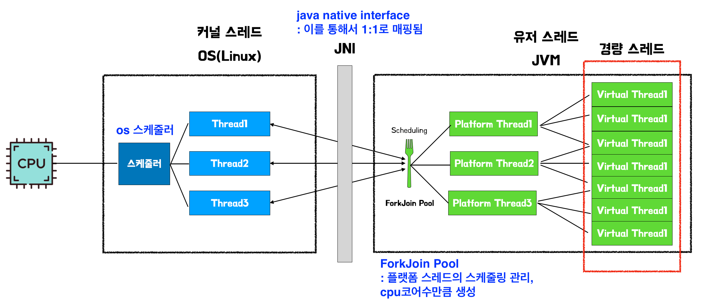

# 7장 Io병목 해결
## 1. 네트워크 io와 자원효율
### 네트워크 개념
서버  프로그램은 기본적으로 네트워크 프로그램이다. 다양한 구성요소와 네트워크로 데이터를 주고 받는다.

### 계층
- L7: HTTP
- L4: TCP 
- L3: IP

### 2가지 요소
- 출력 스트림으로 데이터 내보내기
- 입력 스트림으로 데이터 받기
- 예시) 서버가 db에 출력 스트림으로 쿼리를 보냄 -> db에서 온 데이터를 입력 스트림으로 받음. 

### 일반적인 동작(블로킹 방식)
- Blocking I/O 
  - I/O 동안 스레드 대기(blocked)
- CPU 사용률 향상 방법 
  - 스레드 증가 
- 스레드 한계 
  - 메모리 사용량 증가 
  - 무한 생성 불가 
- 과도한 스레드 문제 
  - Context Switching 비용
- 대표적인 예시
  - tomcat, 요청마다 스레드 할당
- 현실적인 결론 
  - 대부분 트래픽은 낮음 
  - 전통적 모델로도 충분히 동작

### 대안책
하지만 점점 서비스가 성장하면 메모리, cpu자원을 절감하기 위해서 2가지 방법이 있다
- 경량 스레드 사용: 가상스레드, 고 루틴, 코루틴과 같은 경량 스레드 사용
- 논 블로킹 io: 논 블로킹 io 사용

---
## 2. 경량스레드(with java 가상 스레드)

- 경량 스레드는 os가 관리하는 스레드가 아니라 jvm같은 같은 언어의 런타임이 관리하는 스레드이다. 
- ForkJoin Pool이 "os스레드로 실행할 경량 스레드"를 스캐줄링 한다. 
- JNI가 플랫폼 스레드와 커널 스레드를 1:1매핑해준다. 
- 기본 스레드 크기가 1mb인데, 가상스레드는 2kb수준이다. 
- 1만개의 가상스레드 + 8개의 플랫폼 스래드 = 28mb정도만 사용한다. (물론 호출 스택의 깊이에 따라서 스래드 크기를 늘렸다가 줄인다)

### 주의점
Java 21 이전에는 synchronized 사용하면 경우 플랫폼 스레드에 고정(pin)된다

### 성능
- io작업 일 때 효과가 좋음. cpu작업에서는 효과 없음 
- 가상스레드가 플랫폼 스레드보다 적으면 이점을 못 얻는다. 
- 비 경량 스레드는 스래드풀을 만들어서 사용하는데, 가상스레드는 생성비용이 워낙 작아서 미리 스레드풀을 만들어두지는 않고, 그냥 생성해서 사용하고 다 쓰면 소멸시킨다. 

### 가상스레드의 장점
기존 코드를 크게 바꿀 필요가 없다는 것임. 

---
## 3. 논 블로킹 IO(NIO)
### 가상스레드 만으로는 안돼...
사용자가 폭발적으로 증가하면 언젠가는 가상스레드도 한계가 오긴 한다. 메모리를 잡아먹고 스케줄링에 시간을 쓰기 때문.

### 논블로킹 io 동작 개요


### 주요 개념
- 하나의 스레드가 하나의 blocking I/O 호출에 묶여 대기함 -> 그래서 다른 채널에 이미 데이터가 와 있어도 스레드는 처리하지 못함
- NIO에서는 하나의 스레드가 여러 채널의 이벤트를 감시하고, 준비된 채널만 선택적으로 처리할 수 있음. 즉 불필요한 대기를 줄임.
- 이 구조를 가능하게 해주는 핵심 중간 객체가 Selector

왜 스레드는 한번에 하나의 동작만 수행할 수 있나?
1. CPU 코어 하나의 구조:
```
   ┌─────────────────────────┐
   │  Program Counter (PC)   │  ← 딱 하나! "지금 어디 실행 중인지"
   │  ───────────────────    │
   │  Register Set           │  ← 현재 작업의 상태
   │  ───────────────────    │
   │  ALU (연산장치)          │  ← 한 번에 하나씩 계산
   └─────────────────────────┘
```
Program Counter(포인터)가 하나라서, 한 순간에 한 줄의 코드만 실행할 수 있어요
2. 순서가 없으면 결과를 예측할 수 없습니다. 비결정성(non-determinism) 문제를 해결하기 위해서

### 사용 방법
1️⃣ Channel 생성 및 논블로킹 모드로 설정
```
SocketChannel channel = SocketChannel.open();
channel.configureBlocking(false);
```
- Channel은 소켓(Socket)을 “논블로킹 + 이벤트 기반 I/O”로 쓰기 위해 Java가 제공하는 래퍼 객체

2️⃣ Selector 생성 
```java
Selector selector = Selector.open();
```
- Selector는 논블로킹 채널만 등록 가능
- 내부적으로 OS의 이벤트 감시 객체(epoll fd 등) 생성

3️⃣ 감시당할 Channel들을 Selector에 등록 (register)
```java
channel.register(selector, SelectionKey.OP_READ);
```
이 시점에 일어나는 일:
- Selector가 **“이 채널에서 READ 이벤트를 감시해라”**라고 OS에 등록
- 이벤트 종류는 아래에서 살펴보자!

4️⃣ select() 호출 === 이벤트 대기
```java
int readyCount = selector.select();
```

5️⃣ 준비된 채널 목록 획득
```java
Set<SelectionKey> keys = selector.selectedKeys();
```
- 이 Set에는 지금 당장 처리 가능한 채널들만 들어 있음 
- 전체 채널 ❌ / 준비된 채널 ⭕

### SelectionKey 이벤트 종류
Selector에 채널을 등록할 때 감시할 이벤트 타입을 지정한다.

| 상수 | 의미 | 사용 채널 |
|------|------|-----------|
| `OP_ACCEPT` | 새 클라이언트 연결 수락 준비됨 | ServerSocketChannel |
| `OP_READ` | 데이터 읽기 준비됨 (버퍼에 데이터 도착) | SocketChannel |
| `OP_WRITE` | 데이터 쓰기 준비됨 (버퍼에 공간 있음) | SocketChannel |


## 시나리오: 100명의 클라이언트가 Member 조회 요청
```
[Client 1] ──┐
[Client 2] ──┼──▶ [NIO Server] ──▶ [DB]
...      │     (1 Thread)
[Client 100]┘
```
### 전통적인 Blocking io
```java
// 😱 클라이언트 100명 = 스레드 100개 필요
for (Socket client : clients) {
    new Thread(() -> {
        // 이 스레드는 이 클라이언트 전용으로 묶임
        String request = client.read();  // blocking!
        Member member = db.findById(request);
        client.write(member);
    }).start();
}
```
### NIO selector 방식
```java
public class MemberQueryServer {
    
    public static void main(String[] args) throws Exception {
        // 1️⃣ Selector 생성
        Selector selector = Selector.open();
        
        // 2️⃣ 서버 소켓 채널 생성 & 논블로킹 설정
        ServerSocketChannel serverChannel = ServerSocketChannel.open();
        serverChannel.bind(new InetSocketAddress(8080));
        serverChannel.configureBlocking(false);
        
        // 3️⃣ 서버 채널을 Selector에 등록 (ACCEPT 이벤트 감시)
        serverChannel.register(selector, SelectionKey.OP_ACCEPT);
        
        System.out.println("서버 시작 - 단일 스레드로 100개 연결 처리 가능!");
        
        // 4️⃣ 이벤트 루프 (단일 스레드!)
        while (true) {
            // 이벤트가 발생할 때까지 대기 (하나라도 준비되면 반환)
            // 이벤트 올 때까지 이 줄에서 안 내려감
            selector.select();// ← 여기서 멈춤 💤 (5분이든 1시간이든)
            
            // 5️⃣ 준비된 채널들만 가져옴
            Set<SelectionKey> selectedKeys = selector.selectedKeys();
            Iterator<SelectionKey> iter = selectedKeys.iterator();
            
            while (iter.hasNext()) {
                SelectionKey key = iter.next();
                iter.remove();  // 처리한 키는 반드시 제거
                
                if (key.isAcceptable()) {
                    // 🔵 새 클라이언트 연결 수락 -> 바로 OP_READ 등록
                    handleAccept(serverChannel, selector);
                    
                } else if (key.isReadable()) {
                    // 🟢 클라이언트가 데이터를 보냄 (읽을 준비 됨)
                    handleRead(key);
                    
                } else if (key.isWritable()) {
                    // 🟡 클라이언트에게 데이터 보낼 준비 됨
                    handleWrite(key);
                }
            }
        }
    }

  // 새 연결 수락
  static void handleAccept(ServerSocketChannel server, Selector selector)
          throws Exception {
    ...
    // 이 클라이언트의 READ 이벤트 감시 등록
    client.register(selector, SelectionKey.OP_READ);
  }

  // 클라이언트 요청 읽기
  static void handleRead(SelectionKey key) throws Exception {
    // ... 요청 처리 ...
    Member member = findMemberById(memberId);

    // ... 요청 처리 ...
    key.interestOps(SelectionKey.OP_WRITE); // ✅ READ → WRITE 전환
  }

  // 🟢 다시 READ로 전환 - 응답 보낸 후
  static void handleWrite(SelectionKey key) {
    // ... 응답 전송 ...
    key.interestOps(SelectionKey.OP_READ);   // ✅ WRITE → READ 전환
  }
}
```

---

## 핵심 흐름 도식화
```
[단일 스레드의 이벤트 루프]

select() 호출
    │
    ▼
┌─────────────────────────────────────────────────────┐
│  Selector가 100개 채널을 동시에 감시 중...           │
│                                                     │
│  Channel 1:  대기 중 😴                              │
│  Channel 2:  대기 중 😴                              │
│  Channel 23: ✅ READ 준비됨! (memberId=M001 도착)    │
│  Channel 45: ✅ READ 준비됨! (memberId=M002 도착)    │
│  Channel 78: ✅ WRITE 준비됨! (응답 전송 가능)       │
│  ...나머지: 대기 중 😴                               │
└─────────────────────────────────────────────────────┘
    │
    ▼
selectedKeys = { key23, key45, key78 }  ← 3개만 반환!
    │
    ▼
┌─────────────────────────────────────────────────────┐
│ for (key : selectedKeys)                            │
│                                                     │
│   key23 → handleRead()  → DB조회 → Member 반환      │
│   key45 → handleRead()  → DB조회 → Member 반환      │
│   key78 → handleWrite() → 클라이언트에 응답 전송    │
└─────────────────────────────────────────────────────┘
    │
    ▼
다시 select() 호출 (무한 루프)
```

### OP_WRITE는 처음부터 등록하면 안됩니다.

OP_WRITE는 소켓 버퍼에 공간만 있으면 "준비됨" 상태가 된다.
→ 보낼 데이터가 없는데도 select()가 계속 "WRITE 가능!" 반환
→ CPU 낭비 (busy-wait)

| 이벤트 | 등록 시점 | 이유 |
|--------|-----------|------|
| OP_READ | 연결 직후 바로 등록 | 언제 데이터 올지 모름 |
| OP_WRITE | 보낼 데이터 있을 때만 등록 | 평소엔 항상 준비 상태라 의미 없음 |

**OP_WRITE 해제 패턴 (실제 코드)**
```java
// WRITE 이벤트 처리
if (key.isWritable()) {
    int written = channel.write(buffer);

    if (!buffer.hasRemaining()) {  // 다 보냄
        key.interestOps(OP_READ);  // WRITE 해제!
    }
}
```
→ 해제 안 하면 select()가 계속 "WRITE 가능!" 반환 → CPU 낭비 (busy-wait)

## 리액터 패턴
동시에 들어오는 여러 이벤트를 처리하기 위한 패턴
리액터와 핸들러로 구성됨. 리액터가 이벤트 발생시까지 대기하다가 알맞는 헨들러에 이벤트 전달함.

## 프레임워크 사용하기
논블로킹 I/O를 직접 구현하면 복잡한 문제들이 생긴다:
- 클라이언트별 버퍼 관리
- 불완전한 메시지 조립 (한 요청이 여러 read()에 나눠서 도착)
- Selector 이벤트 루프 관리
- 프로토콜 파싱

**Netty 같은 프레임워크가 이를 모두 추상화해준다.**

| 프레임워크 | 특징 |
|------------|------|
| **Netty** | 가장 널리 쓰임, 고성능 |
| **Spring WebFlux** | Netty 기반 + 리액티브 스트림 |
| **Vert.x** | 폴리글랏, 이벤트 기반 |


