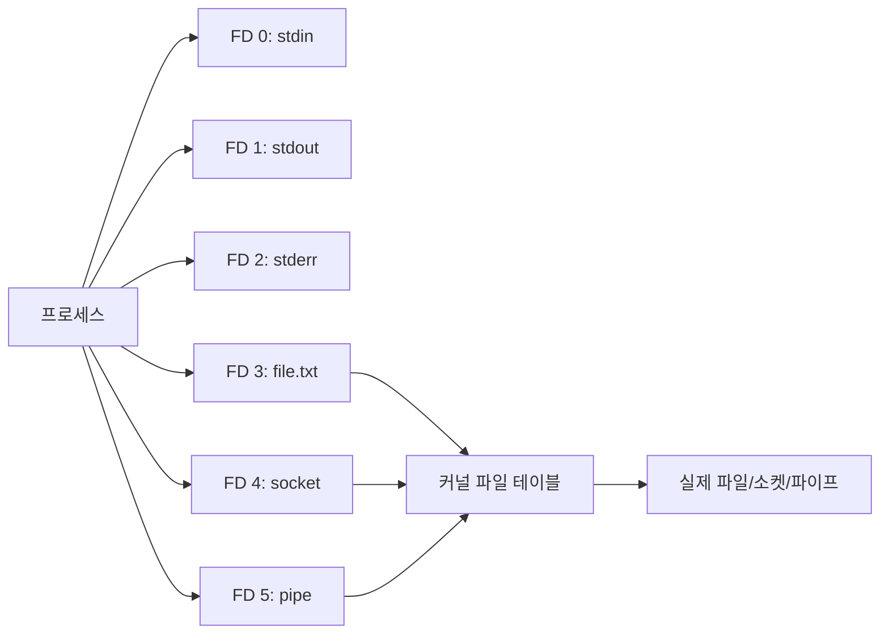
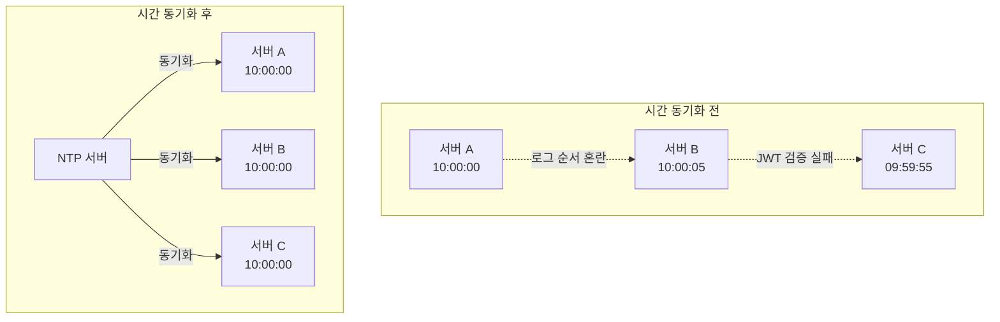
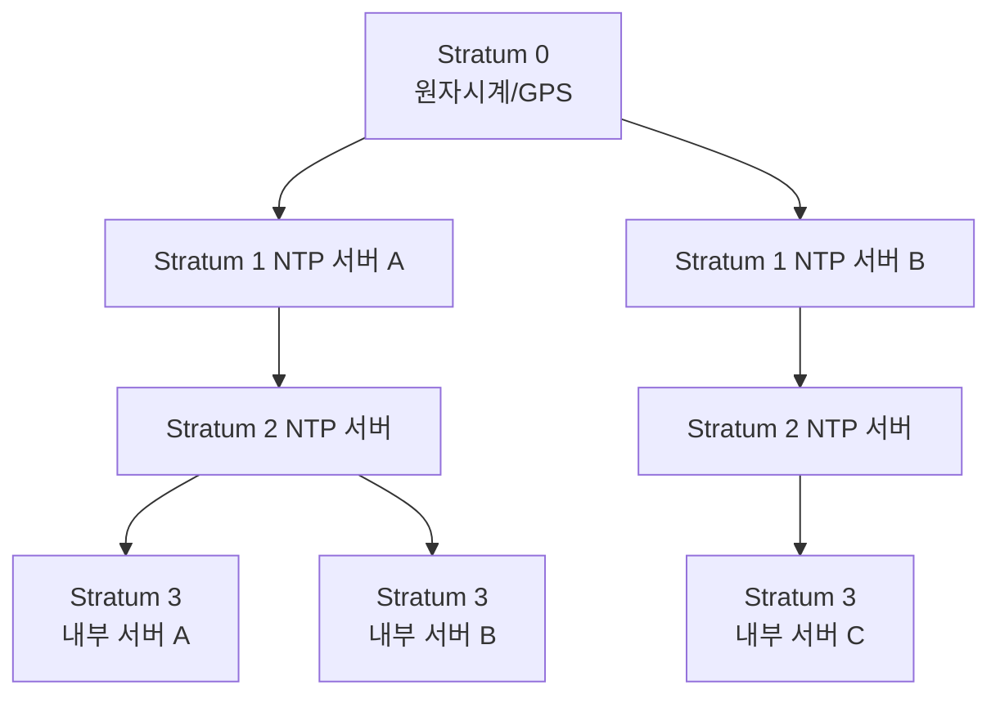

## 1. 로그 파일 관리

### 1.1 로그 파일 증가 관측 방법

#### 디스크 사용량 확인
```bash
# 디스크 사용량 확인
df -h

# 특정 디렉토리 내 파일 크기 확인
du -sh /var/log/*

# 크기 순으로 정렬하여 상위 10개 파일 확인
du -h /var/log/* | sort -rh | head -10
```

#### 로그 파일 찾기
```bash
# 1GB 이상의 로그 파일 찾기
find /var/log -type f -size +1G

# 최근 24시간 내 수정된 로그 파일 찾기
find /var/log -type f -mtime -1 -ls
```

### 1.2 문제 해결 방법

#### /dev/null 활용

`/dev/null`은 모든 입력을 버리는 특수 파일이다.

**실행 중인 로그 파일 비우기**
```bash
# 잘못된 방법 - 파일이 삭제되어 파일 디스크립터가 유효하지 않게 됨
rm /var/log/application.log

# 올바른 방법 - 파일 내용만 비우고 파일 디스크립터 유지
cat /dev/null > /var/log/application.log
```

**불필요한 출력 버리기**
```bash
# 표준 출력 버리기
command > /dev/null

# 표준 에러 버리기
command 2> /dev/null

# 모든 출력 버리기
command > /dev/null 2>&1
```

### 1.3 실시간 로그 모니터링

```bash
# 로그 실시간 확인
tail -f /var/log/application.log

# 여러 파일 동시 모니터링
tail -f /var/log/application.log /var/log/error.log

# 패턴 필터링하여 모니터링
tail -f /var/log/application.log | grep ERROR
```

---

## 2. 파일 디스크립터 개념과 문제 해결

### 2.1 파일 디스크립터란?

파일 디스크립터(File Descriptor, FD)는 프로세스가 열어둔 파일을 참조하는 정수값이다. 리눅스에서는 "모든 것이 파일"이라는 철학에 따라 일반 파일뿐만 아니라 소켓, 파이프, 디바이스도 파일 디스크립터로 관리된다.

#### 표준 파일 디스크립터
- `0`: stdin (표준 입력)
- `1`: stdout (표준 출력)
- `2`: stderr (표준 에러)

#### 파일 디스크립터가 사용되는 곳
- 파일 읽기/쓰기
- 네트워크 소켓 연결
- 파이프 통신
- 이벤트 파일 디스크립터 (eventfd)



### 2.2 파일 디스크립터 제한 확인

#### 프로세스별 제한
```bash
# 현재 셸의 제한 확인
ulimit -n

# 소프트/하드 제한 모두 확인
ulimit -Sn  # soft limit
ulimit -Hn  # hard limit
```

#### 특정 프로세스가 사용 중인 FD 확인
```bash
# 프로세스가 열어둔 파일 목록
lsof -p <PID>

# FD 개수 확인
lsof -p <PID> | wc -l
```

### 2.3 자주 발생하는 문제

#### 문제 : "Too many open files" 에러
```
java.io.IOException: Too many open files
accept4() failed (24: Too many open files)
```

**원인**
- 애플리케이션에서 파일/소켓을 열고 닫지 않음
- 프로세스 FD 제한이 너무 낮게 설정됨
- 커넥션 풀 설정 과다

**해결 방법**

1. **임시 조치**
```bash
# 프로세스 제한 확인
prlimit --pid <PID> --nofile

# 실행 중인 프로세스의 제한 변경 (root 권한 필요)
prlimit --pid <PID> --nofile=65536:65536
```

2. **ulimit 설정**
`/etc/security/limits.conf` 수정
```conf
# username  type  item   value
*           soft  nofile 65536
*           hard  nofile 65536
app_user    soft  nofile 100000
app_user    hard  nofile 100000
```

3. **systemd 서비스 설정**
`/etc/systemd/system/application.service`
```ini
[Service]
LimitNOFILE=100000
```
```bash
systemctl daemon-reload
systemctl restart application
```

4. **시스템 전체 제한 증가**
`/etc/sysctl.conf`
```conf
fs.file-max = 2097152
```
```bash
sysctl -p
```

---

## 3. 서버 간 시간 동기화와 NTP

### 3.1 시간 동기화가 중요한 이유

분산 시스템에서 서버 간 시간이 동기화되지 않으면 다음과 같은 문제가 발생한다

- **로그 분석 어려움**: 여러 서버의 로그를 타임스탬프로 추적할 때 순서가 뒤섞임
- **인증 토큰 문제**: JWT, OAuth 토큰의 만료 시간 검증 실패
- **분산 트랜잭션**: 타임스탬프 기반 동시성 제어 실패
- **캐싱**: TTL 기반 캐시 무효화 오작동
- **데이터베이스 복제**: 마스터-슬레이브 복제 시 시간 불일치로 데이터 정합성 문제
- **모니터링 메트릭**: 시계열 데이터 분석 왜곡



### 3.2 NTP (Network Time Protocol) 소개

NTP는 네트워크를 통해 컴퓨터의 시계를 동기화하는 프로토콜이다.

#### 주요 특징
- **계층 구조(Stratum)**
  - Stratum 0: 원자 시계, GPS 등 기준 시계
  - Stratum 1: Stratum 0에 직접 연결된 서버
  - Stratum 2-15: 상위 stratum과 동기화
- **정확도**: 일반적으로 공용 인터넷에서 수십 밀리초 이내
- **UDP 포트 123** 사용

#### NTP 서버 계층 구조


### 3.3 시간 동기화 확인

```bash
# 현재 시스템 시간 확인
date

# 하드웨어 클럭 확인
hwclock --show

# 시간대 확인
timedatectl

# NTP 동기화 상태 확인
timedatectl show-timesync --all
```

### 3.4 주의사항

1. **시간을 절대 뒤로 돌리지 마라**
   - 데이터베이스 트랜잭션, 로그 타임스탬프 등이 꼬임
   - NTP를 사용하면 시간을 서서히 조정함 (slew)

2. **여러 NTP 서버 사용**
   - 단일 장애점 방지
   - 최소 3-4개 서버 권장

3. **방화벽 설정**
   - UDP 123 포트 허용 필요

4. **가상화 환경 주의**
   - VM에서는 하이퍼바이저 시간 동기화 사용
   - VM 내부 NTP와 충돌 방지
