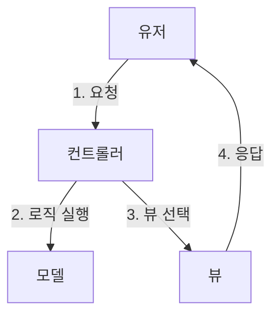

# 자주 쓰는 서버 구조와 설계 패턴

## MVC 패턴

- Model - View - Controller 3개로 구성된 패턴
  - 모델 : 비즈니스 영역의 로직을 처리
  - 뷰 : 사용자가 보게 될 결과를 생성해서 사용자에게 응답
  - 컨트롤러 : 사용자의 입력 처리와 흐름 제어를 담당

MVC 패턴 구조



1. 컨트롤러가 사용자의 요청을 알맞게 해석한 뒤, 모델에 비즈니스 로직 실행을 위임
2. 모델은 사용자가 요청한 기능을 실행후 컨트롤러에 결과를 리턴
3. 컨트롤러는 모델 처리 결과를 바탕으로 사용자에게 보여줄 뷰를 선택
4. 뷰는 사용자에게 결과 화면을 보여준다

### MVC 패턴의 핵심

1. 비즈니스 로직을 처리하는 모델과 결과를 생성하는 뷰를 분리한다
   - 모델은 비즈니스와 관련된 로직만 처리
   - 뷰는 사용자에게 알맞은 응답을 제공하는 역할만 처리
2. 애플리케이션의 흐름 제어나 사용자의 요청 처리는 컨트롤러에 집중한다

## 계층형 아키텍쳐

- 계층마다 특정 역할 수행, 하위에 위치한 계층에만 의존

  ```mermaid
  flowchart TD
      L1[계층1] -.->L2[계층2]
      L2[계층2] -.->L3[계층3]
  ```

- 웹 애플리케이션을 구현할때는 일반적으로 4개 계층 구헝

  ```mermaid
  flowchart TD
      L1["표현(또는 UI)"] -.->L2[응용]
      L2 -.->L3["도메인(또는 모델)"]
      L3 -.->L4["인프라(또는 영속)"]
  ```

  - 표현(또는 UI) : 사용자와의 상호 작용 담당 (MVC의 컨트롤러와 뷰)
  - 응용 : 사용자의 요청을 실제로 처리 (서비스 layer)
  - 도메인/모델 : 도메인 로직을 구현
  - 인프라/영속 : DB 연동 (DAO)

- 도메인 영역이 없거나 빈약한 경우, 도메인 로직이 응용 or 인프라 계층으로 분산된다
  - 이를 방지하기 위해선 도메인 로직을 최대한 한 계층으로 모아야한다
  - 도메인 로직을 한 곳에 모으는 방법 중 하나가 바로 DDD의 전술 패턴을 사용하는 것

## DDD와 전술패턴

전술패턴?

- DDD(Domain-Driven Design)에서 사용하는 도메인 모델을 실제 코드로 구현하는 패턴

- 도메인 모델
  - 엔티티(Entity): 고유 식별자를 가진 객체로, 상태와 비즈니스 규칙을 포함.
  - 밸류(Value Object): 식별자 없이 값 자체로 의미를 가지며 불변인 객체, 관련 규칙 포함 가능.
  - 애그리거트(Aggregate): 관련 엔티티와 밸류를 하나의 단위로 묶어 관리하며, Aggregate Root가 외부 접근의 진입점 역할.
  - 리포지토리(Repository): Aggregate Root 단위로 저장/조회하며 DB 접근을 전담.
  - 도메인 서비스(Domain Service): 한 엔티티에서 처리하기 어려운 비즈니스 규칙이나 여러 Aggregate를 조합하는 로직 담당.
  - 도메인 이벤트(Domain Event): Aggregate에서 중요한 사건을 표현하며 다른 서비스나 Aggregate가 반응할 수 있도록 알림.

## 마이크로 서비스 아키텍쳐

- 작은 단위로 서비스를 분리하고 각 서비스가 연동되는 구조

### 마이크로 서비스의 6가지 핵심 개념

1. 독립적 배포
   - 다른 마이크로 서비스 배포 없이, 마이크로 서비스를 배포, 변경할 수 있어야함
2. 도메인 중심 모델링
   - 각 마이크로서비스는 도메인을 기준으로 구분
   - 도메인의 기능 구현이 여러 마이크로서비스에 걸쳐 있으면 출시 비용이 증가
3. 자신의 상태를 가짐
   - 마이크로서비스는 DB를 공유하지 않음
   - 다른 마이크로 서비스의 데이터 사용할 경우 API 통해 접근
4. 크기
   - 조직이 감당한 수 있는 수준과 정의에 맞는 사이즈로
5. 유연함
   - 비용을 들여 유연함을 얻는 구조.
   - 감당 가능한 비용 선에서 도입 고려
6. 아키텍쳐와 조직을 맞춤
   - 비즈니스 도메인이 시스템 아키텍처를 주도하도록 설꼐

## 이벤트 기반 아키텍쳐

- 두 시스템 간에 통신할 때 이벤트를 사용하는 구조

- 이벤트 기반 아키텍처의 구성요소

  - 이벤트 생산자
  - 이벤트 소비자
  - 이벤트 브로커(라우터)

  ```mermaid
  flowchart LR
      A(이벤트 생산자) -->|이벤트| B("이벤트 브로커
      (라우터)")
      B -->|이벤트| D[이벤트 소비자]
      B -->|이벤트| E[이벤트 소비자]

  ```

  1. 이벤트 생성자가 이벤트를 생성해서 브로커에 전달
  2. 브로커는 해당 이벤트에 관심 있는 소비자에게 이벤트를 전달
  3. 이벤트 소비자는 이벤트를 받아 적절하게 반응

- 장점
  - 생산자와 소비자가 직접 연결되지 않고 크로커를 통해 간접적으로 연결
  - 서로 간섭하지 않고 독립적으로 배포 가능
  - 새로운 소비자 추가도 용이
    - 반면, 이벤트가 중간 브로커를 거치기 때문에 이벤트의 처리 상태를 추적하려면 별도의 추가 수단 필요

## CQRS 패턴

- Command Query Responsibility Segregation
- 명령과 조회의 모델을 분리하는 패턴

  - 명령 : 상태 변경 (CUD)
  - 조회 : 상태 조회 (R)

- 장점
  - 명령/조회를 구분하기에 각 기능에 맞게 모델을 구현할 수 있음
  - 조회 모델이 별도로 존재하기에 조회 성능을 향상시킬 수 있음
- 단점
  - 기능마다 모델을 따로 만들어야하므로 작업해야 할 코드가 늘어남
    - 추가되는 코드 대비 얻는 이점이 있는지 따져봐야함
  - 구현 기술이 늘어날 수 있음
    - 명령 모델과 조회 모델을 서로 다른 기술로 구현하는 경우
